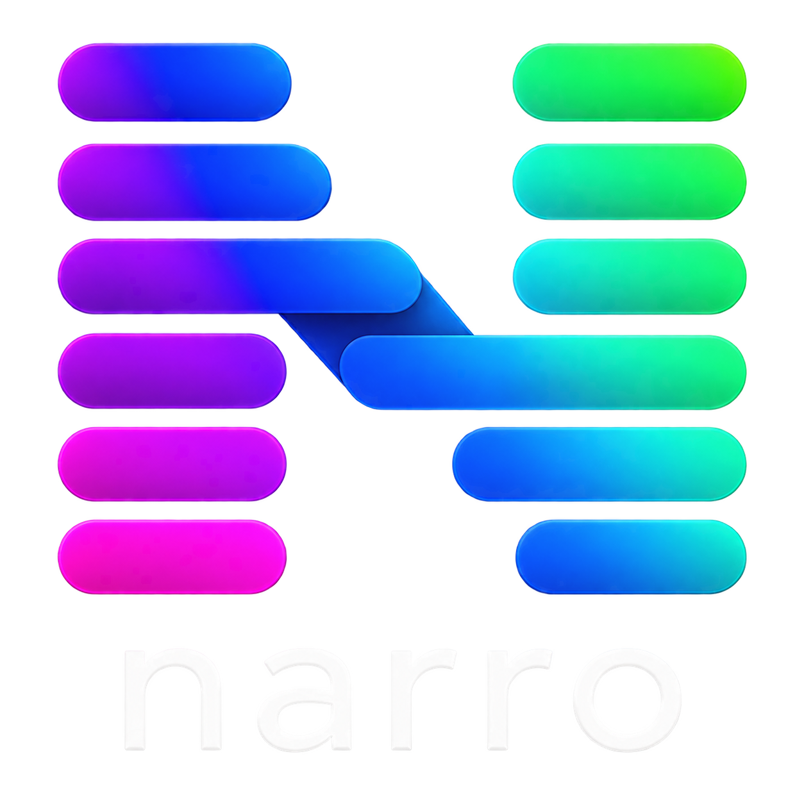

  

# Narro

Narro is a personal, local-only **Windows desktop productivity application** inspired by the core Blitzit planning -> focus workflow, rebuilt without accounts, cloud services, subscriptions, telemetry or multi-user infrastructure.

The project prioritizes:

- fast planning-to-focus workflow;
- a compact Focus Panel and lightweight always-on-top Floating Timer;
- reliable local timer/session tracking;
- stable task identity/order/scheduling behavior;
- Windows-native lifecycle, monitor, shortcut, tray and notification behavior;
- recognizable source-product hierarchy and interaction character without reproducing known bugs.

## AI / coding-agent continuation

**If you are an AI taking over this repository with no previous chat context, start here:**

[`AI_START_HERE.md`](AI_START_HERE.md)

The repository is intentionally **self-handing-off**. ChatGPT, Codex, Antigravity/Gemini, Claude-like coding agents, Copilot or another capable AI should be able to continue from the latest repository state without the user copying a custom prompt, previous-chat summary or agent-specific rules.

Canonical continuation files:

- `AI_START_HERE.md` — universal zero-context bootstrap;
- `AGENTS.md` — durable product/engineering/correctness rules;
- `AGENT_WORKFLOW.md` — multi-agent evidence/commit/handoff protocol;
- `HANDOFF.md` — exact current continuation point;
- `TODO.md` — ordered work; `[x]` means implemented **and validated**;
- `STATUS.md` — concise project-level truth and architecture/capability state;
- `work-log/*.md` — preferred immutable per-slice implementation/validation logs for new work;
- `WORK_LOG.md` — legacy historical archive retained for older context.

Agent-specific files such as `GEMINI.md`, `CLAUDE.md` and `.github/copilot-instructions.md` are thin pointers to the same canonical state. `prompts/*` are optional historical/slice aids, not required onboarding.

## Current phase

**Milestone 1 — Windows architecture/capability/performance validation.**

Research/specification and reference assets are complete enough for implementation. A Tauri 2 + React + TypeScript + Rust + SQLite Windows scaffold and temporary runtime diagnostic harness now build successfully through Windows GitHub Actions.

Real Windows testing has already proven shared Rust state between the `main` and `focusSurface` webviews plus survival of Rust state when `main` is forcibly destroyed. The current exact blocker/retest state is always recorded in:

[`HANDOFF.md`](HANDOFF.md)

Do not infer current progress from this README alone.

## Product scope

Initial Narro scope includes:

- local lists and tasks;
- Backlog / This Week / Today / Done planning;
- EST and actual Time Taken;
- scheduling, recurrence and local reminders;
- subtasks and rich task notes;
- focus sessions;
- Focus Panel;
- movable always-on-top Floating Timer;
- EST countdown, Pomodoro and count-up modes;
- Windows shortcuts/global hotkeys;
- local archive/search/preferences;
- light/dark/system theme;
- local productivity/session reports and local exports where specified.

Explicitly excluded unless the project owner changes scope:

- accounts/login/auth;
- subscriptions/billing/licensing/trials;
- cloud backend or cloud sync;
- collaboration/multi-user;
- remote integrations/webhooks/MCP;
- AI/Blitzy;
- telemetry sent off-device;
- remote calendar sync;
- remote voice transcription;
- macOS/Linux/mobile/web targets.

## Current technical direction

Starting architecture:

- **Tauri 2** desktop shell;
- **React + TypeScript** frontend;
- **Rust** authoritative runtime/domain/native coordination;
- **SQLite** durable local persistence with migrations;
- **WebView2** Windows renderer runtime;
- normally only two webview windows:
  - `main`;
  - `focusSurface`, reused for Focus Panel and Floating Timer.

This is an evidence-driven starting architecture, **not an immutable mandate**. Milestone 1 exists to validate native behavior and measure floating-only CPU/RAM before product UI is built. If concrete Windows evidence proves a better approach, future agents may change the architecture through the documented decision/evidence process in `AGENTS.md` and `AGENT_WORKFLOW.md`.

## Fidelity and reliability target

Narro should be recognizably related to the supplied current Blitzit desktop experience, not a generic task manager. Original screenshots and research are evidence for hierarchy, density and workflow, not assets or infallible implementation instructions.

Narro intentionally improves source-product friction where evidence supports it, including:

- no hover layout shift or moving pointer targets;
- robust long-title handling;
- explicit note-URL activation only;
- authoritative non-renderer timer/session state;
- stable immutable task IDs;
- anti-duplication reorder/schedule behavior;
- explicit date-only vs date+time scheduling;
- dynamic monitor/off-screen recovery;
- larger/resizable Notes editing while preserving compact focus access;
- reduced-motion support;
- strict idle-resource discipline for Floating Timer.

## Research and specifications

Broad source-product research is already complete. Do not repeat it by default.

Primary implementation references:

- `docs/PRODUCT_SPEC.md` — domain/product behavior;
- `docs/UI_UX_SPEC.md` — visual hierarchy, states, motion and accessibility;
- `docs/ARCHITECTURE.md` — current technical architecture proposal;
- `docs/RESEARCH_EVIDENCE.md` — supplied screenshot inventory and source conflicts;
- `docs/SOURCE_AUDIT.md` — exhaustive official/source/feedback research;
- `docs/REFERENCES.md` — compact direct-link source index;
- `reference/original-blitzit-screenshots/` — original-product visual references.

Optional planning/verification aids live in `docs/BEHAVIOR_MATRIX.md`, `docs/DECISION_GATES.md`, `docs/INTERACTION_CAPTURE_GUIDE.md` and `docs/decisions/`. They are aids, not additional product requirements.

## Branding

The logo shown above is the official Narro identity supplied by the project owner.

Canonical source:

`assets/branding/narro-logo-master.png`

Verified master metadata recorded by the project:

- 1254 x 1254 RGBA;
- 916,927 bytes;
- SHA-256 `c553431248aafc705ce20230a69418769e41e019f0eea4dc88d0949c9bb05a5a`.

Windows application/installer/taskbar/tray derivatives should be generated from that master. Do not substitute Blitzit branding, independently redesign the Narro mark, or use a low-quality derivative as the primary brand source.

## Development principle

The repository separates:

1. **binding user requirements/invariants**;
2. **observed Blitzit behavior/visual evidence**;
3. **current Narro implementation proposals**.

Future agents may improve proposals when a better approach is measurably simpler, more reliable, faster, lighter, more accessible or more Windows-appropriate while preserving product intent. Material durable deviations must be documented rather than silently introduced.

The latest implementation truth is always `HANDOFF.md` + `STATUS.md` + the active `TODO.md` milestone, verified against actual code/tests/CI.
