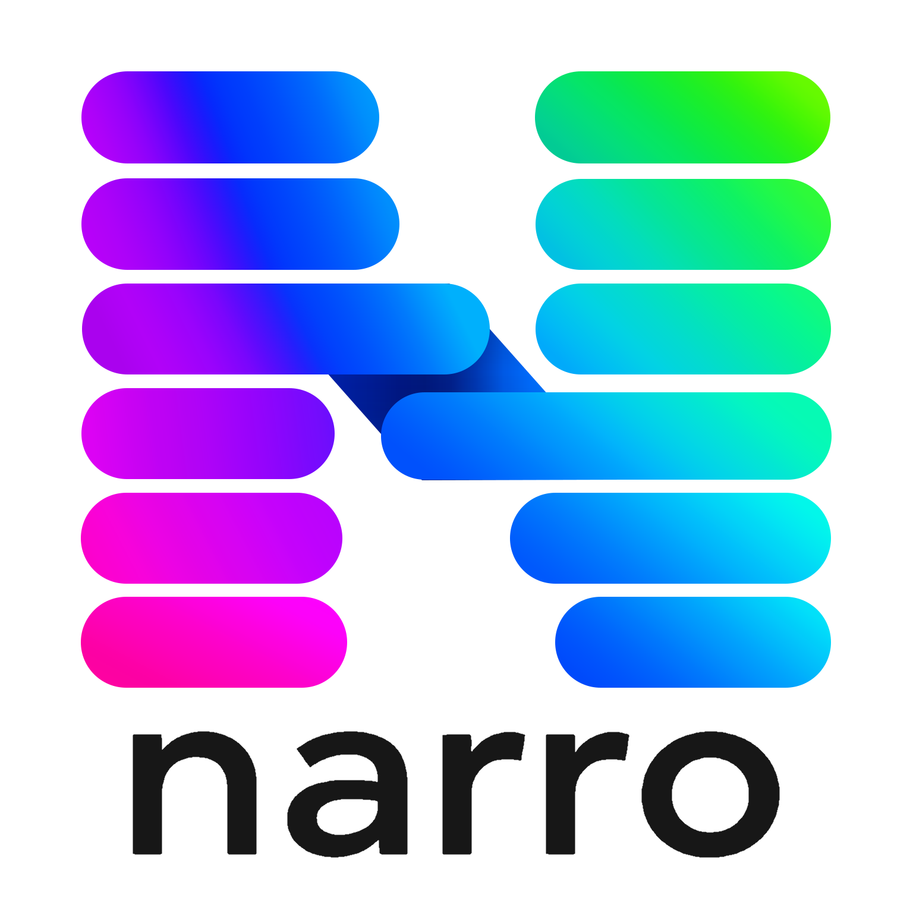

  <picture>
    <source media="(prefers-color-scheme: dark)" srcset="assets/branding/narro-logo-stacked-dark.svg">
    <source media="(prefers-color-scheme: light)" srcset="assets/branding/narro-logo-stacked-light.svg">
    
  </picture>

# Narro

Narro is a personal, local-only **Windows desktop productivity application** inspired by the core Blitzit planning -> focus workflow, rebuilt without accounts, cloud services, subscriptions, telemetry or multi-user infrastructure.

The project prioritizes:

- fast planning-to-focus workflow;
- a compact Focus Panel and lightweight always-on-top Floating Timer;
- reliable local timer/session tracking;
- stable task identity/order/scheduling behavior;
- Windows-native lifecycle, monitor, shortcut, tray and notification behavior;
- recognizable source-product hierarchy and interaction character without reproducing known bugs.

## AI / coding-agent continuation

**If you are an AI taking over this repository with no previous chat context, start here:**

[`AI_START_HERE.md`](AI_START_HERE.md)

The repository is intentionally **self-handing-off**. ChatGPT, Codex, Antigravity/Gemini, Claude-like coding agents, Copilot or another capable AI should be able to continue from the latest repository state without the user copying a custom prompt, previous-chat summary or agent-specific rules.

Canonical continuation files:

- `AI_START_HERE.md` — universal zero-context bootstrap;
- `AGENTS.md` — durable product/engineering/correctness rules;
- `AGENT_WORKFLOW.md` — multi-agent evidence/commit/handoff protocol;
- `HANDOFF.md` — exact current continuation point;
- `TODO.md` — ordered work; `[x]` means implemented **and validated**;
- `STATUS.md` — concise project-level truth and architecture/capability state;
- `work-log/*.md` — preferred immutable per-slice implementation/validation logs for new work;
- `WORK_LOG.md` — legacy historical archive retained for older context.

Agent-specific files such as `GEMINI.md`, `CLAUDE.md` and `.github/copilot-instructions.md` are thin pointers to the same canonical state. `prompts/*` are optional historical/slice aids, not required onboarding.

## Current phase

Normal ordered evidence analysis, implementation/corrections and validation for the open M1–M9 work, with existing FIX_NOW and acceptance dependencies determining priority. Temporary capture-only restrictions belonged to the originating Windows chat and do not block other chats. M2–M4 are complete; M1 monitor/DPI acceptance is narrowly reopened, and M5–M9 retain validation/source-parity gates. M10 is blocked until all required M1–M9 acceptance clears.

The exact capture candidate is CI953/source `38219e20` from open draft PR235. Separate async-read WIP is backed up but uncompiled/native-unvalidated and unmerged. Documentation/evidence publication on main is separate from application-source acceptance.

Start from [HANDOFF](HANDOFF.md), [TODO](TODO.md) and [STATUS](STATUS.md). The [capture navigation index](work-log/evidence/ci953-capture-index-20261005/README.md) links11 follow-up packets; capture counts are not reviewed/PASS counts. Current authoritative tracking takes precedence over dated historical checkpoints.

Review existing recordings/logs before requesting repeated acquisition; batch compatible evidence-backed corrections and validate them normally. Browser Ctrl+Shift+T A/B/C is closed by [personal user validation](work-log/2026-10-05-user-manual-browser-shortcut-pass.md). See [chat-scope clarification](work-log/2026-10-05-chat-scope-continuation-clarification.md); no custom prompt is needed merely to lift the old chat's capture restrictions.

## Product scope

Initial Narro scope includes:

- local lists and tasks;
- Backlog / This Week / Today / Done planning;
- EST and actual Time Taken;
- scheduling, recurrence and local reminders;
- subtasks and rich task notes;
- focus sessions;
- Focus Panel;
- movable always-on-top Floating Timer;
- EST countdown, Pomodoro and count-up modes;
- Windows shortcuts/global hotkeys;
- local archive/search/preferences;
- light/dark/system theme;
- local productivity/session reports and local exports where specified.

Explicitly excluded unless the project owner changes scope:

- accounts/login/auth;
- subscriptions/billing/licensing/trials;
- cloud backend or cloud sync;
- collaboration/multi-user;
- remote integrations/webhooks/MCP;
- AI/Blitzy;
- telemetry sent off-device;
- remote calendar sync;
- remote voice transcription;
- macOS/Linux/mobile/web targets.

## Current technical direction

Starting architecture:

- **Tauri 2** desktop shell;
- **React + TypeScript** frontend;
- **Rust** authoritative runtime/domain/native coordination;
- **SQLite** durable local persistence with migrations;
- **WebView2** Windows renderer runtime;
- exactly two normal runtime webview windows in the current corrective architecture:
  - `main`;
  - one persistent fixed-host `focusSurface`, whose React root dynamically presents Focus Panel, compact Timer, or expanded Timer.

Normal Panel/Timer switching is component/presentation toggling inside `focusSurface` plus native visible-region/position coordination; it is not implemented by opening/closing, hiding/showing, resizing, or alternating multiple Focus WebViews. This architecture is currently selected from the recorded Windows evidence. Reopen it only if exact-build validation proves the single-host design technically insufficient.

## Fidelity and reliability target

Narro should be recognizably related to the supplied current Blitzit desktop experience, not a generic task manager. Original screenshots and research are evidence for hierarchy, density and workflow, not assets or infallible implementation instructions.

Narro intentionally improves source-product friction where evidence supports it, including:

- no hover layout shift or moving pointer targets;
- robust long-title handling;
- explicit note-URL activation only;
- authoritative non-renderer timer/session state;
- stable immutable task IDs;
- anti-duplication reorder/schedule behavior;
- explicit date-only vs date+time scheduling;
- dynamic monitor/off-screen recovery;
- larger/resizable Notes editing while preserving compact focus access;
- reduced-motion support;
- strict idle-resource discipline for Floating Timer.

## Research and specifications

Broad source-product research is already complete. Do not repeat it by default.

Primary implementation references:

- `docs/PRODUCT_SPEC.md` — domain/product behavior;
- `docs/UI_UX_SPEC.md` — visual hierarchy, states, motion and accessibility;
- `docs/ARCHITECTURE.md` — current technical architecture proposal;
- `docs/RESEARCH_EVIDENCE.md` — supplied screenshot inventory and source conflicts;
- `docs/SOURCE_AUDIT.md` — exhaustive official/source/feedback research;
- `docs/REFERENCES.md` — compact direct-link source index;
- `reference/original-blitzit-screenshots/` — original-product visual references.

Optional planning/verification aids live in `docs/BEHAVIOR_MATRIX.md`, `docs/DECISION_GATES.md`, `docs/INTERACTION_CAPTURE_GUIDE.md` and `docs/decisions/`. They are aids, not additional product requirements.

## Branding

Narro branding is maintained from the owner-supplied pure-vector artwork under `assets/branding/`.

Canonical scalable sources:

- `narro-logo-stacked-light.svg` / `narro-logo-stacked-dark.svg` — stacked lockups for light/dark surfaces;
- `narro-logo-horizontal-light.svg` / `narro-logo-horizontal-dark.svg` — horizontal lockups;
- `narro-symbol.svg` — symbol-only transparent vector;
- `narro-app-icon-light.svg` / `narro-app-icon-dark.svg` — square launcher/app-icon compositions.

`narro-logo-master.svg` is retained as a compatibility alias of the stacked-light vector. PNG files in the same folder are raster derivatives, not the editable source of truth.

The supplied PureVector kit was independently audited: all 16 SVG files are genuine vector XML with paths/rectangles/gradients, no embedded raster images, no external image resources, no scripts and no live text/font dependency. Platform-specific Android, iOS and web/PWA export trees are intentionally not copied into this Windows-only repository.

Do not substitute Blitzit branding or independently redraw/recolor/distort the Narro mark.

## Development principle

The repository separates:

1. **binding user requirements/invariants**;
2. **observed Blitzit behavior/visual evidence**;
3. **current Narro implementation proposals**.

Future agents may improve proposals when a better approach is measurably simpler, more reliable, faster, lighter, more accessible or more Windows-appropriate while preserving product intent. Material durable deviations must be documented rather than silently introduced.

The latest implementation truth is always `HANDOFF.md` + `STATUS.md` + the active `TODO.md` milestone, verified against actual code/tests/CI.
