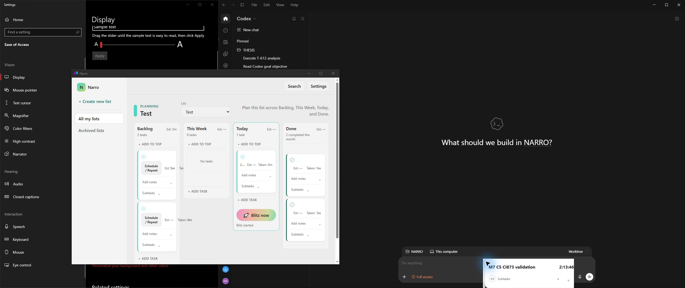
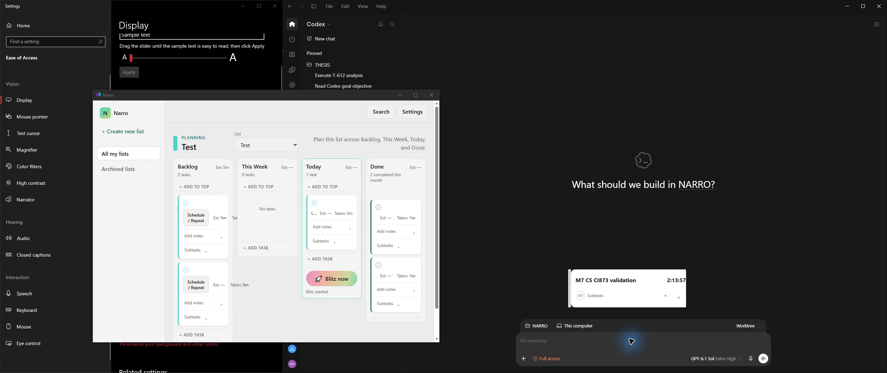
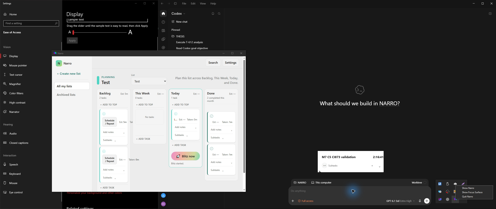
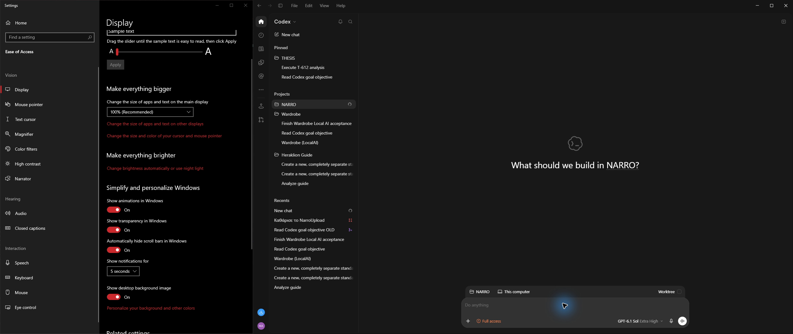
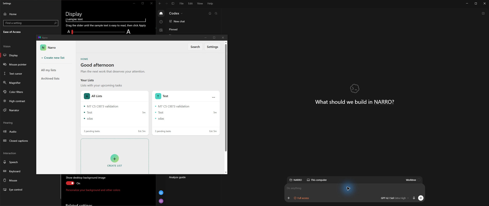
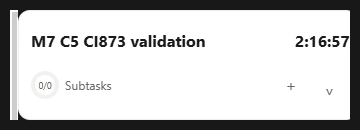
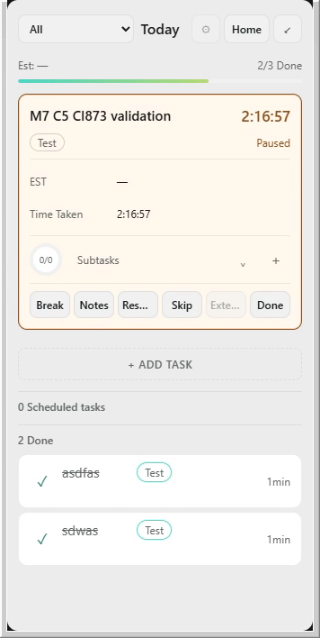
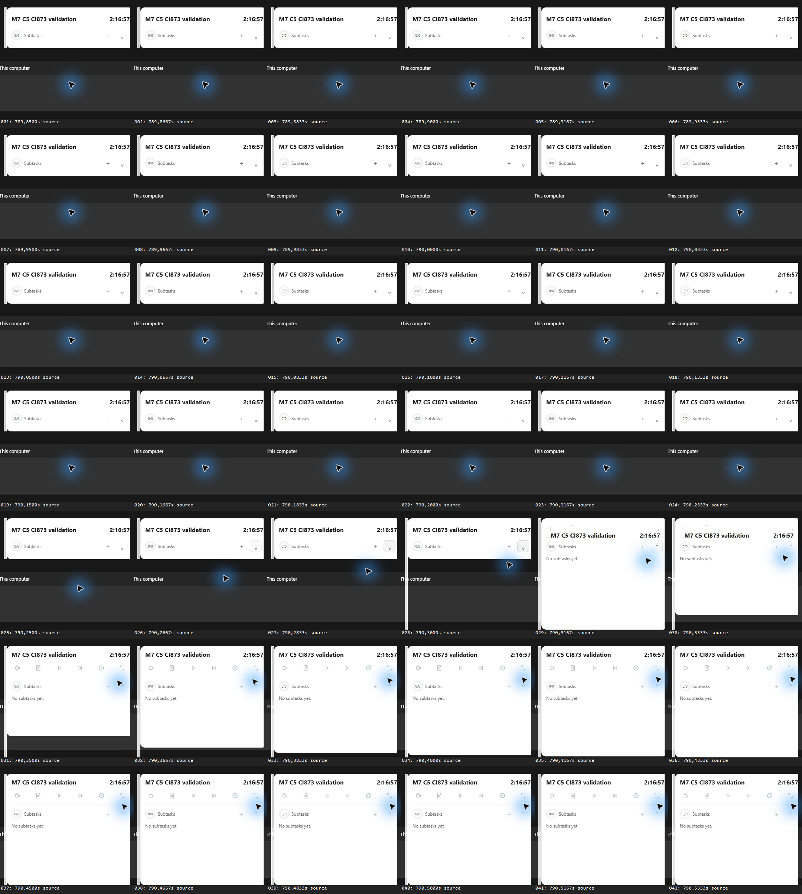
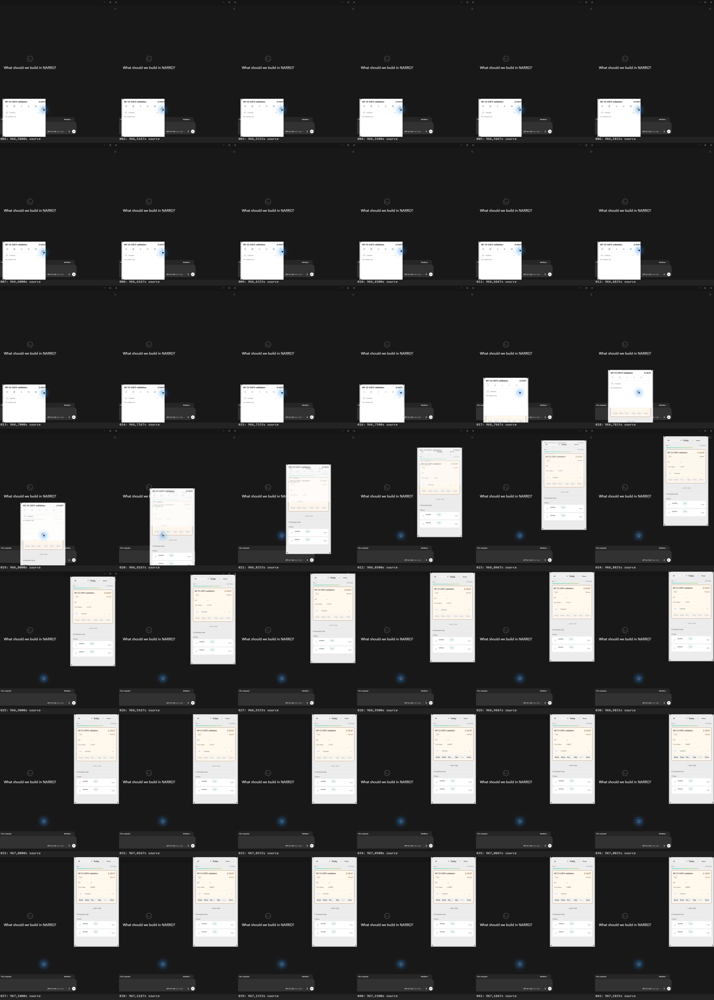
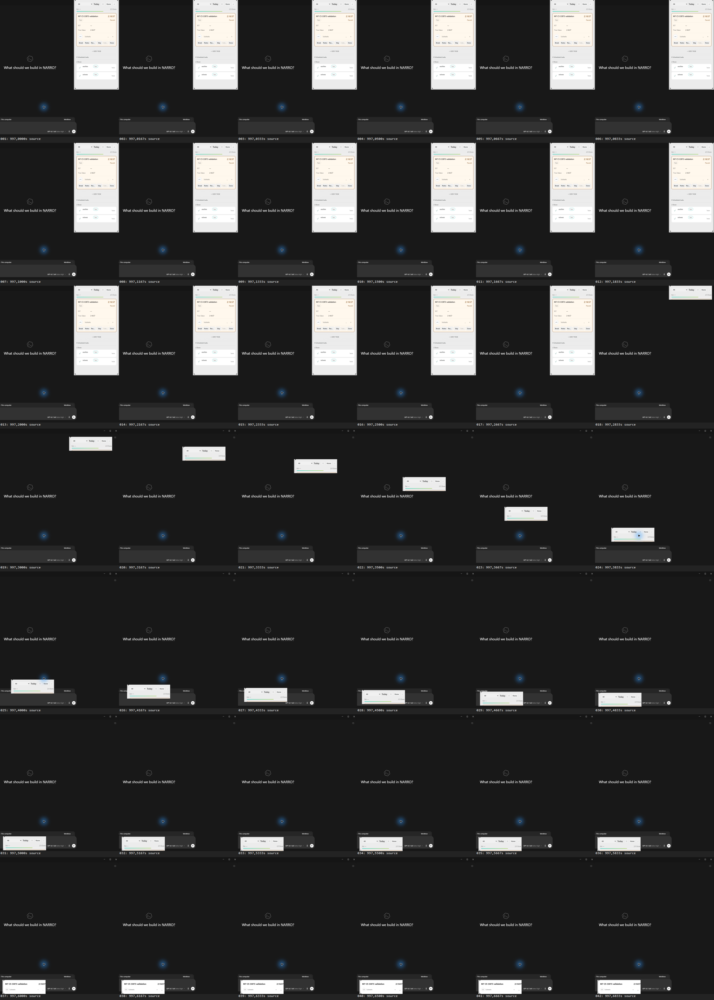

# CI #873 C5 video and visual review

**Start here for another chat:** the [completed run](2026-10-03-codex-m7-ci873-c5-completed.md) establishes C5 saved-position restart PASS on the requested exact EXE. Download the videos and inspect the PNGs below for independent visual review. GitHub's file page may require **Raw/Download** for MP4 playback. The PNGs are video-derived evidence from the same physical run.

## Continuous C5 sequence

[Download the continuous two-monitor C5 video](evidence/2026-10-03-m7-ci873-c5-completed/c5-continuous-dual-monitor.mp4) — 4480×1080, 60 fps, 5:40; original recording seconds 410–750.

| Excerpt position | Observation |
| --- | --- |
| 00:10–00:20 | Running compact Timer, physical drag to a new safe position |
| 02:53–03:24 | Actual Narro tray menu, then normal Quit |
| 03:30 | Narro windows absent after Quit |
| 04:09–04:25 | Same EXE relaunched; recovered Main/task |
| 04:42–05:00 | Restored compact Timer at the saved position |

The Timer title and Time Taken remain `M7 C5 CI873 validation` / `2:16:57` after restart. Panel explicitly displays **Paused**. Native geometry records the same `(1640,780)` compact region before Quit and after restart, despite a new process/HWND. This jointly supports the physical and native C5 verdict.

## Additional recorded motion — observations, not universal acceptance

Each clip retains both monitors at native resolution and 60 fps. For each transition, 42 consecutive original-video frames are retained at native crop resolution, covering 0.7 s. Contact sheets are navigation aids; use the individual frames to judge fine details. The [motion index](evidence/2026-10-03-m7-ci873-c5-completed/motion-index.json) states source times/crops and contact-sheet scaling.

| Transition | Evidence | Observed content |
| --- | --- | --- |
| Compact→expanded | [2.5 s video](evidence/2026-10-03-m7-ci873-c5-completed/motion/compact-expanded.mp4), [42 native frames](evidence/2026-10-03-m7-ci873-c5-completed/motion/compact-expanded/) | Same title/time remains visible while controls/content reveal; expanded endpoint is populated. Fine action icons are faint/partially revealed in intermediate frames. |
| Expanded→Panel | [2.5 s video](evidence/2026-10-03-m7-ci873-c5-completed/motion/expanded-panel.mp4), [42 native frames](evidence/2026-10-03-m7-ci873-c5-completed/motion/expanded-panel/) | Window moves continuously toward Panel edge. Around original 966.80–966.83 s the outgoing Timer and incoming Panel content visibly overlap; [frame 020](evidence/2026-10-03-m7-ci873-c5-completed/motion/expanded-panel/frame-020.png) preserves both title presentations. Review this against the intended morph/crossfade; do not classify it from source tests alone. |
| Panel→compact | [2.5 s video](evidence/2026-10-03-m7-ci873-c5-completed/motion/panel-compact.mp4), [42 native frames](evidence/2026-10-03-m7-ci873-c5-completed/motion/panel-compact/) | Around original 997.28–997.57 s a clipped 110 px Panel-header strip travels toward the Timer destination before compact task content appears. [Frame 018](evidence/2026-10-03-m7-ci873-c5-completed/motion/panel-compact/frame-018.png) and [frame 030](evidence/2026-10-03-m7-ci873-c5-completed/motion/panel-compact/frame-030.png) make the intermediate content explicit. |

A thin pale strip is visible along the left native edge of the settled Timer and Panel. The settled Panel uses shortened action text **`Res...`** and disabled **`Exte...`** at 100% DPI. These are directly observed visual details, not confirmed Blitzit parity decisions or automatically proven regressions. The inspecting chat should review the exact source fixtures and accessible full labels before choosing any narrow correction. The pointer's blue halo belongs to the computer-input/cursor visualization and is not Narro hover feedback.

No wholly empty window appears in these inspected 42-frame ranges, but incoming/outgoing overlap and header-only transient content prevent a blanket claim of flawless motion. C5 position restoration is unaffected. Normal motion was enabled; reduced-motion replay, long titles, populated subtasks, dark theme, keyboard focus equivalence, error states and the rest of the interface were **not exercised** in this continuation. Historical C4 evidence remains separate.

The original OBS capture was lossy CBR6000 across both monitors. Native-size PNG extraction preserves decoded pixels without further JPEG compression, but does not make the source lossless. The delivery rate and low OBS rendering-stall count support this recording's usability; they cannot certify sub-frame behavior or every display refresh. All supplied frame timestamps are video-relative; UTC event alignment is approximate.
