# CI #873 C5 screenshot gallery for visual review

**C5 is INCOMPLETE / PENDING.** These are the 22 original PNGs already published with the [physical attempt report](2026-10-03-codex-m7-ci873-c5-physical-attempt.md). This page makes them directly visible in a Markdown reader; it adds no new physical run, screenshots, or acceptance claim.

Exact executable: `narro-m7-validation.exe`, SHA-256 `4fde3778720505705ac9c7f9b05a30cb70c26b02c09c6dec442775bc5c66637c`. [Entire logs folder](evidence/2026-10-03-m7-ci873-c5-computer-use-attempt/Narro-M7-Logs/) · [ZIP](evidence/2026-10-03-m7-ci873-c5-computer-use-attempt/Narro-M7-Logs.zip) · [native evaluator](evidence/2026-10-03-m7-ci873-c5-computer-use-attempt/Narro-M7-Logs/m7-c5-latest-result.json).

## Instructions for the reviewing chat

Open and inspect the actual PNG image contents, using the raw image links if the repository connector returns only filenames or Markdown. Review title/time legibility, spacing, clipping, alignment, controls, borders, subtasks, and compact/expanded state consistency. Cite the image filename for each observed issue. Use the linked native metadata for physical position and visible-region geometry; a tightly cropped PNG alone cannot establish the desktop position or always-on-top behavior.

Separate directly visible facts from hypotheses. Early Main captures are rescaled; later Timer images have their own physical capture dimensions. Missing images are not evidence of a defect. No post-relaunch image exists: tray Quit, same-EXE relaunch, and restored Timer were not completed before the Computer Use physical-Escape stop.

These stills can support static visual review and before/after state comparison. They cannot certify animation timing, easing, transient blank frames, flicker, pointer-target stability throughout an interaction, or continuous compositor behavior. This gallery does not close C5 or any other physical gate.

## Key Timer states

### Compact Timer before movement — `10-compact-before-drag.png`

Running dedicated task, elapsed time `00:51`. [Native metadata](evidence/2026-10-03-m7-ci873-c5-computer-use-attempt/Narro-M7-Logs/visual-evidence/10-compact-before-drag-metadata.json).

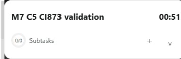

### Moved compact Timer — `13-moved-timer.png`

Elapsed time `05:26`. The native trace recorded qualifying movement of 268 physical pixels. [Native metadata](evidence/2026-10-03-m7-ci873-c5-computer-use-attempt/Narro-M7-Logs/visual-evidence/13-moved-timer-metadata.json).

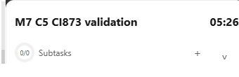

### Expanded Timer — `16-expanded-position.png`

Elapsed time `10:09`; action row and empty subtasks area visible.

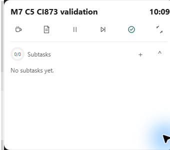

### Final captured compact Timer before attempted Quit — `17-before-quit.png`

Elapsed time `11:23`. Native metadata reports contained visible region `(1805,970)`, `340 × 110`. This is a pre-Quit image, not recovery evidence. [Native metadata](evidence/2026-10-03-m7-ci873-c5-computer-use-attempt/Narro-M7-Logs/visual-evidence/17-before-quit-metadata.json).

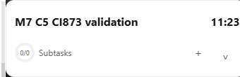

## Other single-state captures

### `01-main.png`

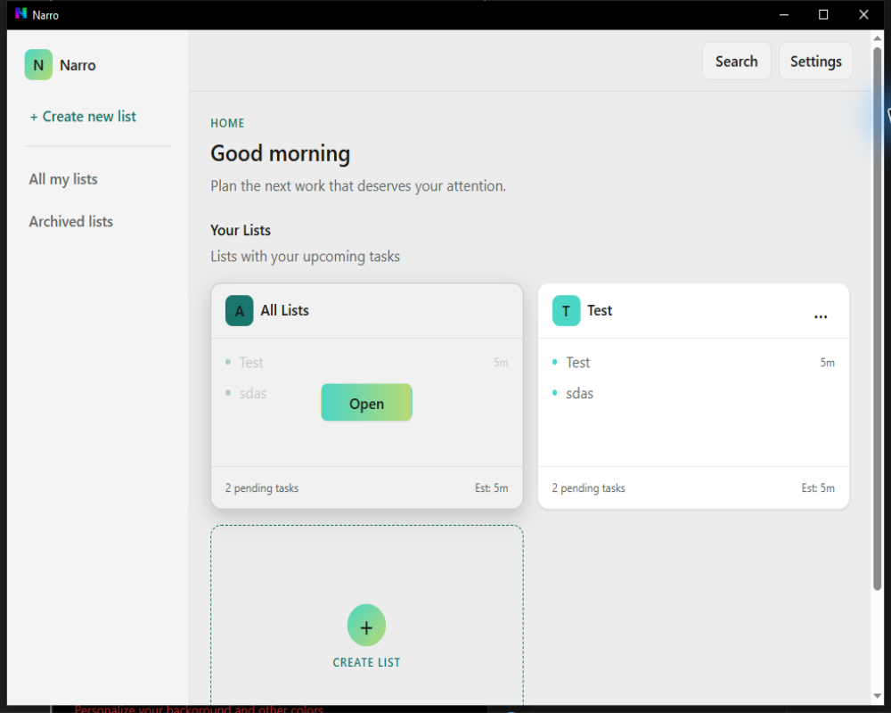

### `02-after-keyboard.png`

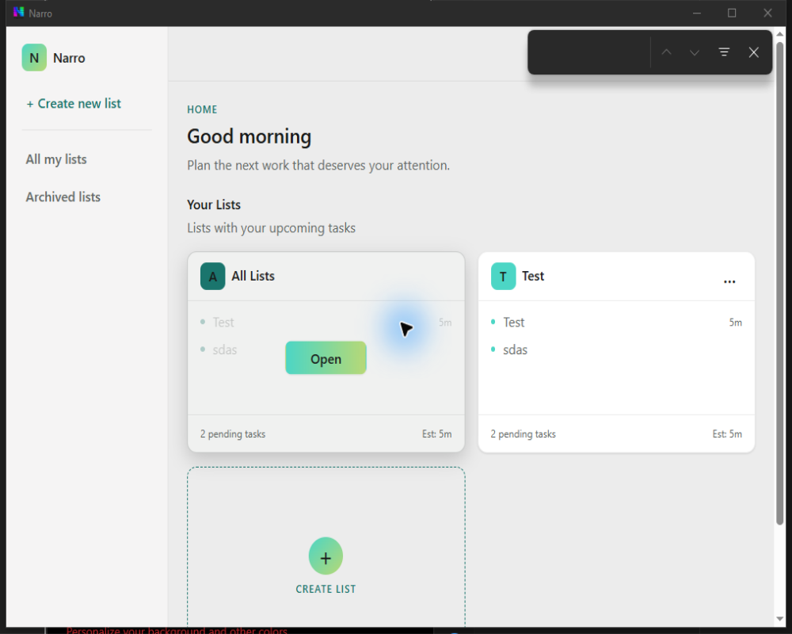

### `03-main-final-native-size.png`

[Main geometry metadata](evidence/2026-10-03-m7-ci873-c5-computer-use-attempt/Narro-M7-Logs/visual-evidence/03-main-window-metadata.json).

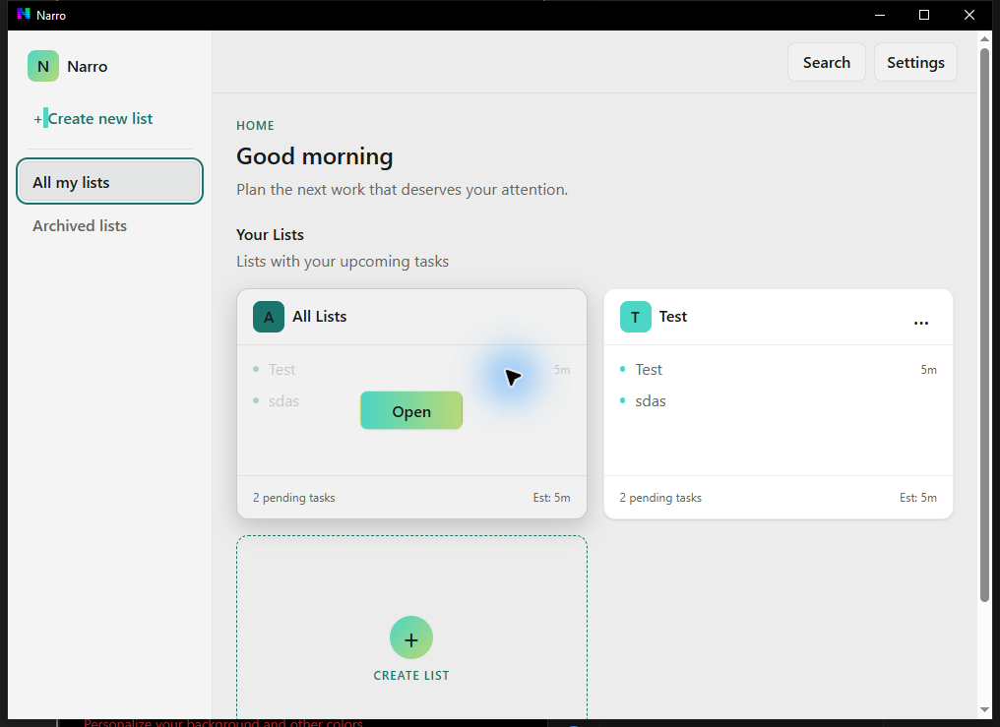

### `04-helper-recovery-main.png`

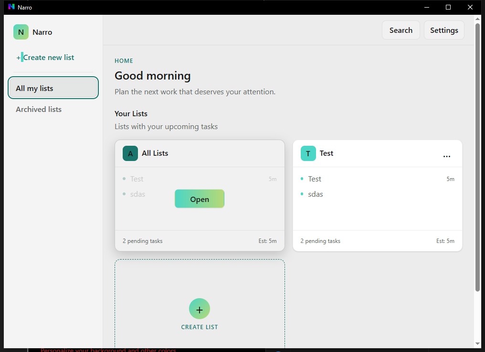

### `05-board.png`

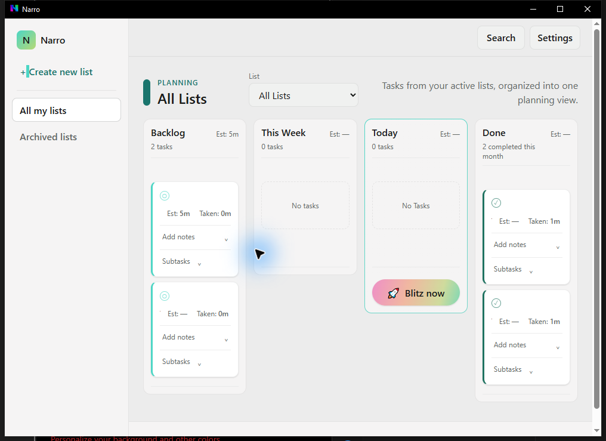

### `06-test-list.png`

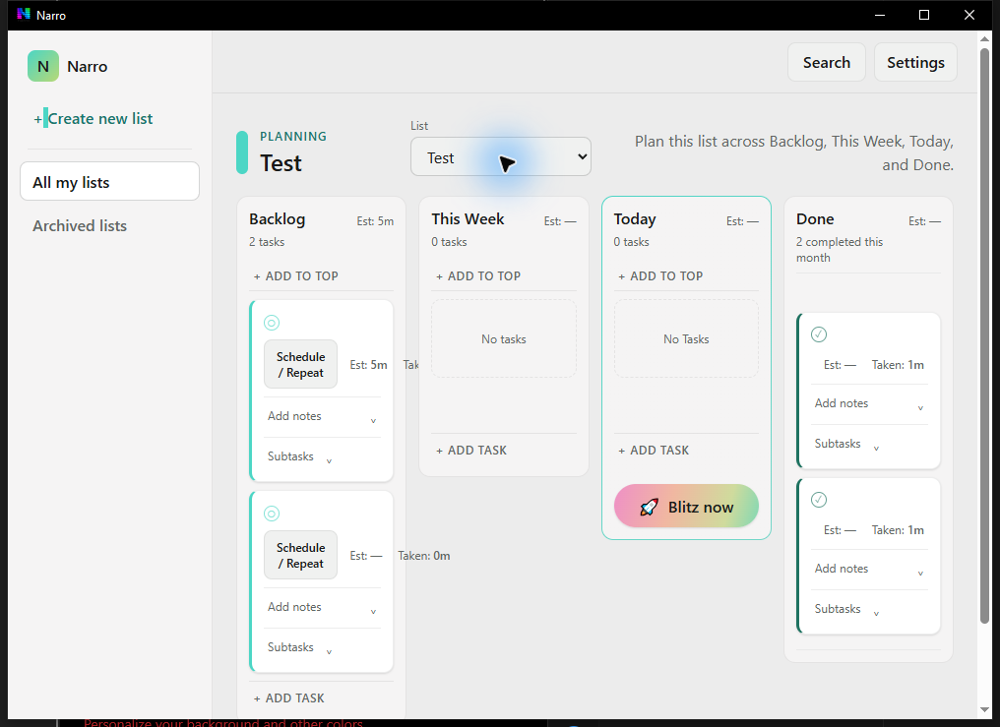

### `07-create-task.png`

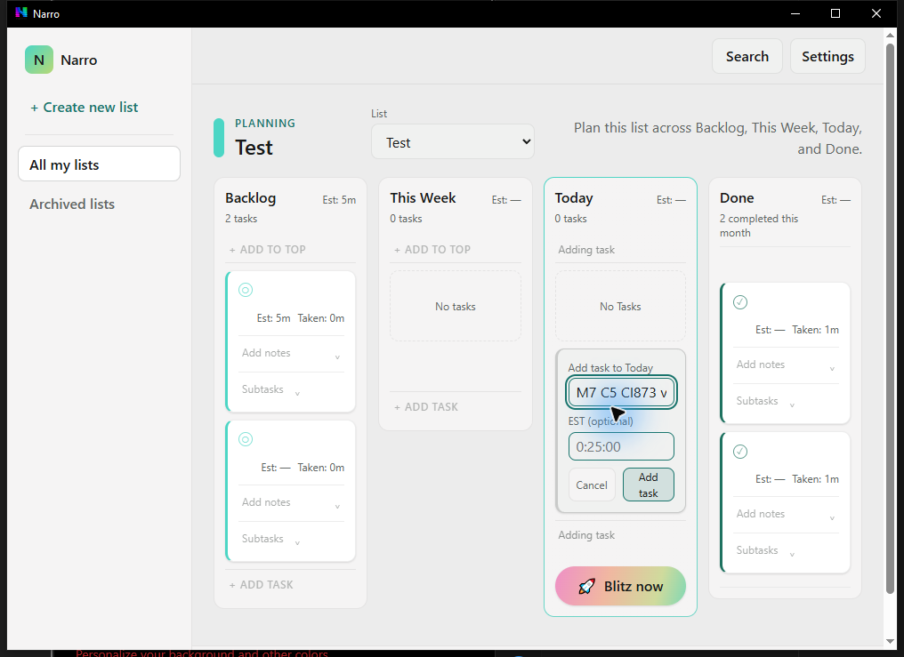

### `08-task-created.png`

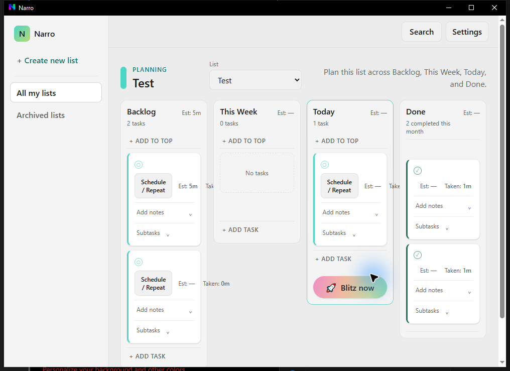

### `11-compact-drag-start.png`

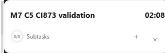

### `12-after-drag.png`

[Native metadata](evidence/2026-10-03-m7-ci873-c5-computer-use-attempt/Narro-M7-Logs/visual-evidence/12-after-drag-metadata.json).

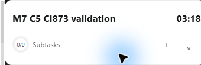

### `14-settled-timer.png`

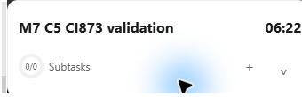

### `15-menu-dismissed.png`

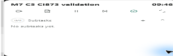

## Short physical frame sequences

Each sequence contains only two frames. Their measured frame gaps are 558 ms, 524 ms and 533 ms respectively, roughly 2 sampled frames per second. They are observation pairs, not animation recordings. No MP4 or high-rate transition capture was produced in this attempt.

### `safe-move-state` — [timestamp metadata](evidence/2026-10-03-m7-ci873-c5-computer-use-attempt/Narro-M7-Logs/visual-evidence/safe-move-state/sequence.json)

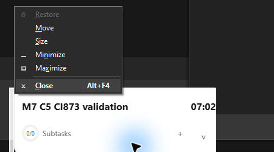

### `tray-before-overflow` — [timestamp metadata](evidence/2026-10-03-m7-ci873-c5-computer-use-attempt/Narro-M7-Logs/visual-evidence/tray-before-overflow/sequence.json)

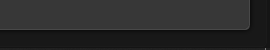

### `tray-observation` — [timestamp metadata](evidence/2026-10-03-m7-ci873-c5-computer-use-attempt/Narro-M7-Logs/visual-evidence/tray-observation/sequence.json)

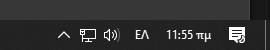

## Motion-capture capability and next evidence

The installed Computer Use `sky` API exposes point-in-time screenshots, not a video-recording endpoint. The repository's `scripts/capture-focus-window-sequence.ps1` and the published `capture-c5-desktop-region.ps1` can capture successive physical desktop frames with timestamps while input is performed separately. A requested delay is not a guaranteed capture frame rate: screen copying, PNG encoding and disk writes add latency. The Focus sequence helper also rescales its output, so native-resolution fixed-region capture is preferable for fine visual details.

To review short hover/focus feedback, tooltip/menu appearance, expand/collapse and Panel/Timer motion, start continuous native-resolution capture before the interaction and retain the whole transition, actual per-frame times, capture region/DPI, and any large gaps. Target 30–60 fps with measured cadence; inspect individual frames and slow playback. A separate recorder/encoder is needed for an MP4. No `ffmpeg`/`ffprobe` command or bundled Python video encoder was available in the environment checks for this follow-up, and no recorder was installed or run.

A future recording must use the same verified EXE and must not treat this existing screenshot set as proof of animation or micro-interaction acceptance. Visual review of hover/focus states needs captures of those interactions; they are not implied by the stills above. Normal and reduced-motion paths remain separate evidence requirements when the affected acceptance criterion calls for both.
