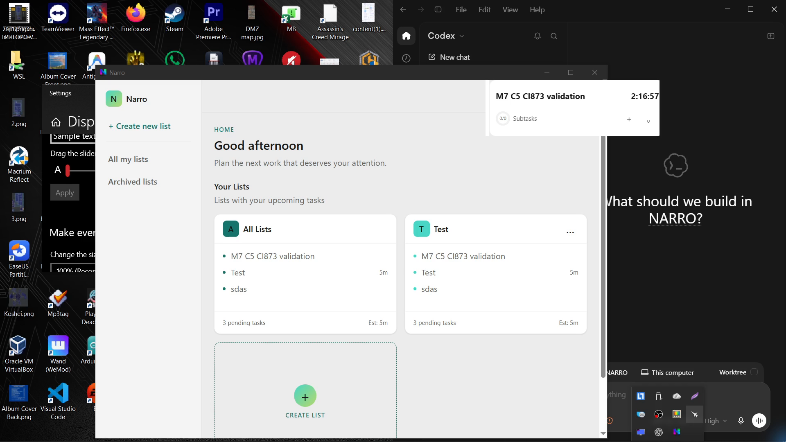
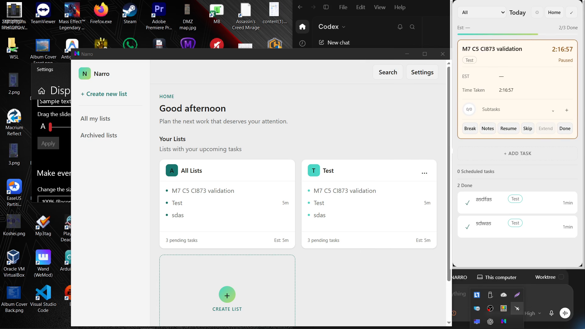
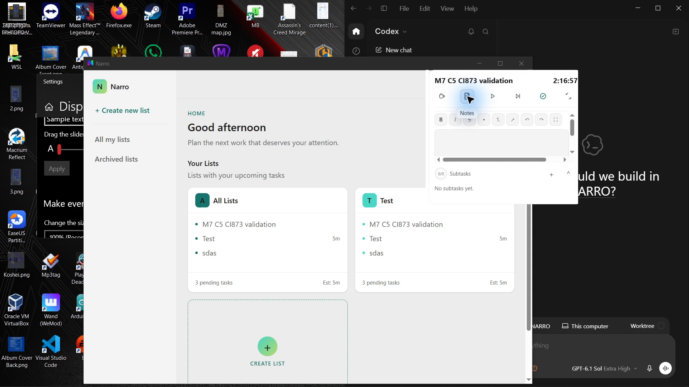
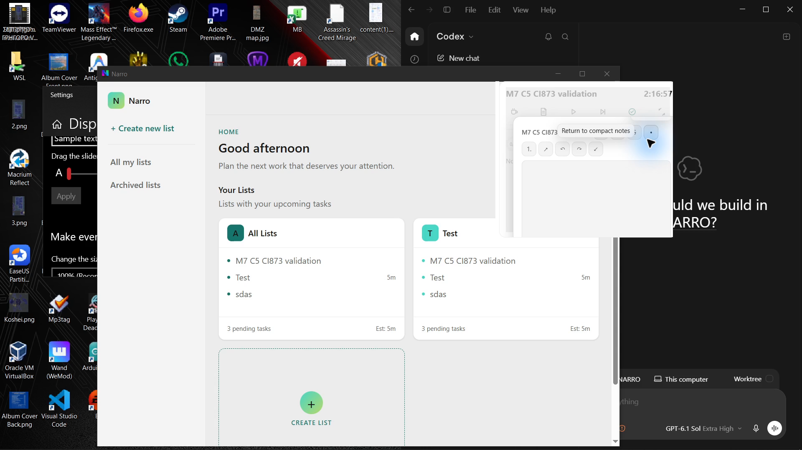
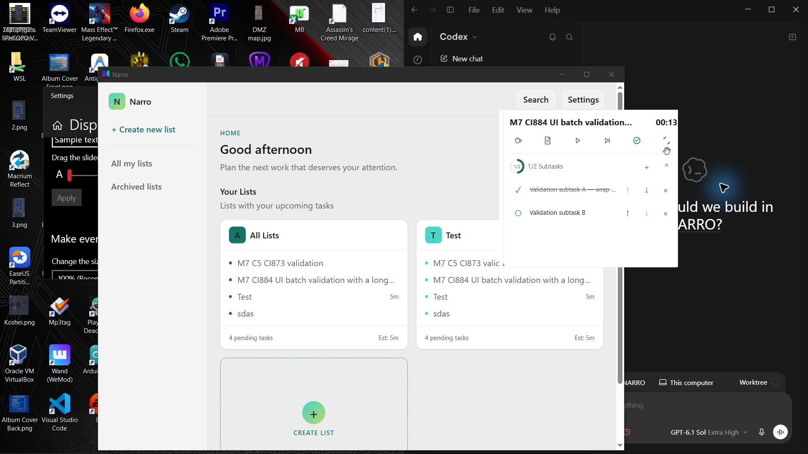
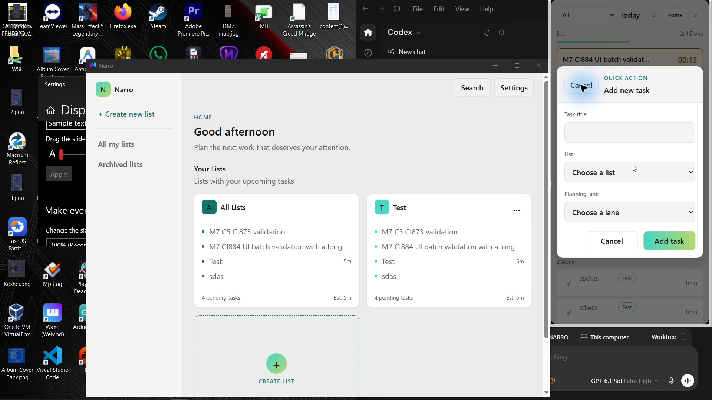
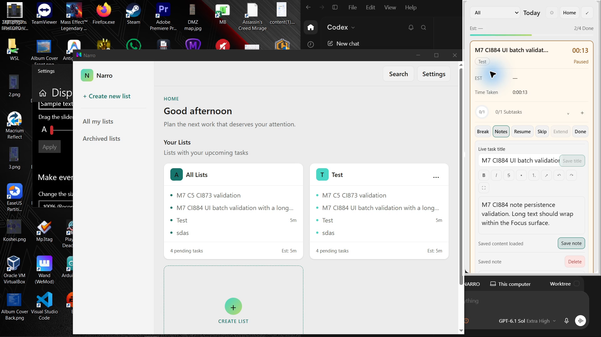
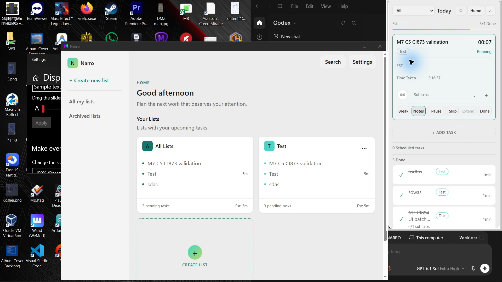

# M7 CI #884: complete video/log snapshot and physical findings

This supersedes the pending duration check and evidence-publication state in [the initial findings](2026-10-03-codex-m7-ci884-batched-findings.md). It does not replace historical CI #873 C5 PASS and does not certify later code.

Exact CI #884 source `5cc184d87ae4f3562e439012292526940a48cb0a`, merged equivalent `1a96da7d8b4c6f4aa2aa58cb7d6bd49726b0fab0`, run `37122117866`, artifact `11274516121`. Tested EXE SHA-256 `a279664e4805eed7673ca30b1e2af6ff0f47356c1d59f8f92dacbdd8e2eb4bb3`; real process 14080 / persistent Focus HWND 82577016.

The [evidence directory](evidence/m7-ci884-20261003/README.md) contains the complete running-process logger snapshot/ZIP, full 90:14.850 video in five consecutive files, eight full-frame video-derived PNGs, six two-second motion clips, 24 dense frame sheets, timestamps, hashes, artifact/CI metadata and recorder log. Video stream continuity is verified: **324,889 source packets = 324,889 published frames**. Review scope is explicitly recorded; idle time and unreviewed frames are preserved.

Only DISPLAY2 1920×1080 at 125% was available during recording. It was not a deliberate restriction to the secondary monitor. Later OS enumeration again showed two displays; no new multi-monitor physical PASS follows from enumeration alone.

| Check | Result | Evidence and practical limit |
|---|---|---|
| Create / Skip / Pause / shared Main projection | PASS | Dedicated task became live, then retained 13 seconds paused; Main reconciled |
| Subtask add/edit/reorder/complete/reopen/delete | PASS | Two distinct identities/titles, 0/2 → 1/2 → 0/2 → 0/1; only dedicated test subtask B deleted |
| Notes save | PASS | Saved note preview reloaded; explicit local action |
| Manual Break / explicit return | PASS | Ten-minute break; Resume restored prior paused work state and 13 seconds |
| Completion retains tracked work | PASS | [Read-only SQLite ledger](evidence/m7-ci884-20261003/completed-task-ledger.json): 13 work seconds + 18 break seconds + 0 final paused work seconds. Reports' rounded 1min is not the authoritative value |
| Expected auto-next | PASS | Original C5 task resumed after completion and was explicitly paused after 19 seconds; Time Taken became 2:17:16 |
| Full Panel labels | PASS at 125%; 100% NOT RUN | Break, Notes, Resume, Skip, Extend, Done all readable at settled state |
| Native frame footprint | FAIL | Settled left strip / Panel lower edge; outer/client insets differ. Exact native host correction requires new EXE testing |
| Inline Notes horizontal layout | FAIL | Unnecessary horizontal scrollbar in expanded Timer. Preserve useful vertical content scrolling |
| Large Notes reachability | FAIL | Footer and right edge outside visible expanded Timer region |
| Greek in-app shortcut | FAIL; English comparison PASS | Focused WebView HKL 4080408 vs 4090409; same Ctrl+Alt+T chord only opened Create under English |
| Create modal keyboard ownership | FAIL | Loading-time focus escaped dialog; Escape did not close it. Pointer Cancel worked |
| Motion content atomicity | FAIL | Normal Panel→compact sheet 1 frame 0 shows incoming compact Timer above still-visible outgoing Panel. Reduced-motion sheet 0 frames 26–27 show the same coexistence. This is a precise continuation of the narrow M7-OBS-20261003-01 content criterion, not a claim of old white-L recurrence |
| No blank target in sampled transition windows | No full blank target observed in reviewed 360 frames | Native strips and mixed content remain failures; this is not universal no-flash acceptance |
| Reduced motion | Partial observation | One reduced round trip recorded; long geometry interpolation absent. Mixed content remains FAIL. OS animations were restored On |
| This candidate drag / tray Quit / relaunch / restore | NOT RUN / evaluator PENDING | Whole log snapshot was taken while app remained paused/running. CI #873's earlier PASS does not certify changed native host code |
| New two-monitor / 100% / topology / performance acceptance | NOT RUN | Must use corrected exact EXE and available desktop conditions; M1 B/C/D remain separate |

## Static visual observations from video

Compact Timer with exposed native left strip, source 735 s:

Settled full Panel labels, source 793 s:

Expanded inline Notes horizontal scrollbar, source 1020 s:

Large Notes clipped by the actual region, source 1070 s:

Subtask progress / expanded actions, source 4695 s:

Create modal, source 5020 s; the image alone cannot prove keyboard focus:

Saved Notes, source 5220 s:

Completed test task and auto-next, source 5320 s:

## Motion observations and implementation disposition

Each [motion case](evidence/m7-ci884-20261003/motion/index.json) has a two-second 60 fps clip plus four half-second sheets. Frames are row-major; sheet-relative frame numbers start at zero. The first two sheets of all six cases were visually inspected. Compact→Panel and expanded→Panel expose the clipped ready Panel and then grow/move into the settled layout; task/time endpoints persist. Compact→expanded reveals the new controls/content while the region grows. No full blank target was observed in these inspected windows, but native borders remain visible.

Panel→compact retains outgoing Panel content underneath the shorter incoming Timer for one normal recorded frame and two reduced-motion frames. Promoting the incoming layer alone is insufficient because the incoming layout is shorter than the old native region. This first physical test of PR #221's content correction therefore leaves that criterion FAIL. CI #887 was cancelled before completing the candidate build so the compatible correction could join PR #222: transfer visual ownership to the ready target in the same paint, restore old ownership on rollback, and add rendered forward/reverse regression checks. No second corrected, CI-green, physically tested content attempt exists yet; the repeated-failure escalation threshold is not asserted from a cancelled/unobserved run.

The candidate also removes Tao's native shadow/resize insets, bounds form/editor geometry, retains drafts and limits resize to the visible region, resolves physical shortcut keys, and owns loading-modal focus. Automated checks and new-source physical checks are tracked separately. No M7 closure or universal UI/source-parity PASS is claimed.
