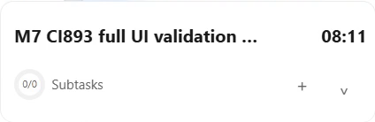
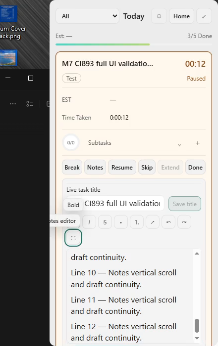
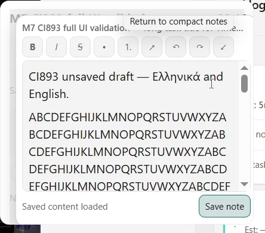
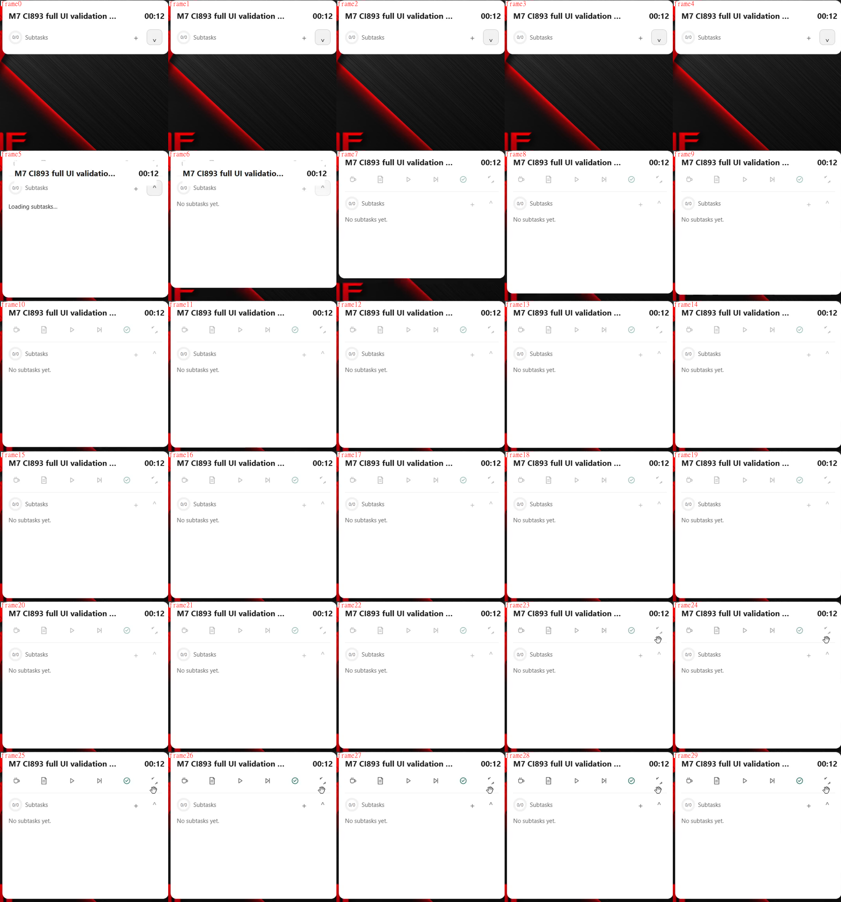
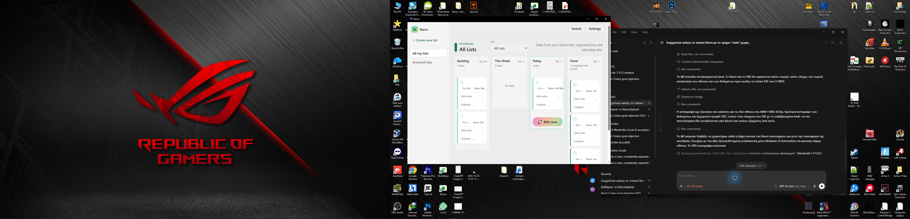

# M7 CI #893 physical batch — partial PASS, actionable FAIL

Exact source `549536c4d19b0045a928652d3feff53162f55a6e`, artifact `11278482082`, EXE SHA-256 `01dd602454f10f85aeecd53eb1bfcdd53368b2eec46fa60cfb5d5cf80385018b` (15027200 bytes). This pinned M7 candidate predates concurrent M9 changes now on main. It does not validate those newer changes.

The authorized real Windows batch used Computer Use launch/UIA/keyboard and observed-coordinate native input after the plugin's window capture and pointer geometry failed. Physical scan-code input was necessary for Greek chords because the automation's translated-key injection did not deliver the same chord. OBS recorded concurrently with app control. There was no physical Escape interruption in this batch.

## Results

| Criterion | Verdict | Actual evidence / limit |
|---|---|---|
| C5 active compact drag, actual tray Quit, same EXE relaunch, visible saved Timer | **PASS** | Deliberate drag `(0,349)→(800,649)`: 800 horizontal / 300 vertical pixels. Old PID 3408, new PID 18520. Native evaluator PASS, same EXE/source/topology at Quit/restart, actual/expected `(800,649)`. Evaluator maximum 1563px includes an earlier topology move; it is not the deliberate drag distance. |
| Restored authoritative work / downtime | **PASS** | Same dedicated task restored **Paused 08:11**. Read-only SQLite has exactly **491 work seconds**, no completion and no downtime work. [Ledger](evidence/m7-ci893-20261003/task-ledger.json). |
| Native frame alignment / complete six Panel action labels | **PASS in observed states** | Panel outer/client 340×700 at 100%, 425×875 at 125%; compact visible region 425×138, expanded 425×375. No previous 9px inset; full Resume/Extend labels. Same Focus HWND through ordinary presentation changes. |
| Greek Create / Notes / Pause and settled modal keyboard | **PASS for exercised chords** | Physical Ctrl+Alt+T/N/P. Create title owns focus; Tab cycles List/lane/footer Cancel/Add/header Cancel/title; Shift+Tab and Escape work. B/S/F and complete English matrix remain NOT RUN in this batch. Delayed loading focus is automated PASS, physically INCONCLUSIVE. |
| Inline Notes horizontal overflow / long draft | **PASS** | 312-character unbroken run wraps; intentional vertical editor scrolling remains. Save and reopen preserve text. |
| Large Panel Notes resize / Escape / reopen / Save | **PASS** | Same unsaved draft survives real resize and return/reopen; Save commits. |
| Whole large Notes contained in expanded Timer region | **FAIL** | At 125%, modal `x=26,y=372,w=405,h=356` extends right to 431 beyond host 425 and bottom 728 beyond visible bottom 724. Save is reachable (right420/bottom712), but that does not make whole-dialog containment PASS. |
| Notes presentation tooltip after toolbar wraps | **FAIL** | Keyboard-open presentation tooltip clips on the left at 100%; fixed end alignment assumes the button remains on the right. |
| Panel↔Timer sole hierarchy / no fully blank target | **PASS for reviewed transitions** | Nine clips, 27 consecutive-frame sheets (810 frames), plus 30 closer expansion frames. No previous outgoing Panel below the compact target was observed. This is scoped native-content acceptance, not universal motion or Blitzit parity. |
| Compact→expanded transient geometry | **FAIL** | Closer frames 5–6 at recording2 ~461.93s show premature tall surface and displaced heading/action strip before stable expanded layout. Native video detail retained below. |
| Planning task titles at default small main window | **FAIL** | Board cards have an invisible zero-width title track, while Home/Focus show the stored titles. CSS reserves completion + 100px action rail plus gaps inside narrow lanes; title receives no space. Narrow M5 layout acceptance is reopened. |
| Always on top over independent maximized window | **PASS** | Real maximized Notepad with Timer visibly above. OBS foreground attempt did not actually maximize/paint and is not acceptance evidence. Borderless/exclusive full-screen not tested. |
| Monitor crossing / reconnect matrix | **PARTIAL / NOT RUN** | Initially DISPLAY1 2560×1080 100% and DISPLAY2 1920×1080 125%. Primary display became unavailable during a long idle gap; only DISPLAY2 remained. Native position was safely clamped and UI remained visible. `/extend` did not restore the unavailable display. This is not a controlled complete reconnect/crossing matrix or M1 Candidate B acceptance. |
| Floating-only paused CPU/RAM, three repeats | **MEASURED** | 15s warm-up +60s samples each, main closed, OBS stopped, root PID18520. Average one-core CPU 0.000 /0.026 /0.000%; working set408.9 /405.4 /404.3MiB. Stable process tree. Harness process-name guard adapted only to diagnostic filename; copy retained. This is supplemental CI893 measurement, not formal separate M1 Candidate B closure or a comparative regression claim. |

OS animations were restored On. Narro remains paused on the dedicated task. The production DB was backed up before this batch; no restore or destructive data reset occurred.

## Full evidence and visual review

[Complete Narro-M7-Logs folder](evidence/m7-ci893-20261003/Narro-M7-Logs), [whole-folder ZIP](evidence/m7-ci893-20261003/Narro-M7-Logs.zip), [C5 native result](evidence/m7-ci893-20261003/Narro-M7-Logs/m7-c5-latest-result.json), [manifest](evidence/m7-ci893-20261003/manifest.json), [actions](evidence/m7-ci893-20261003/actions.jsonl), [OBS log](evidence/m7-ci893-20261003/obs-session.log), [performance](evidence/m7-ci893-20261003/performance), [frame timestamp index](evidence/m7-ci893-20261003/frame-index.json).

Four continuous **4480×1080 /60fps** recordings are retained in full as MP4 parts under [video](evidence/m7-ci893-20261003/video). Every H264 and AAC packet is preserved by stream copy, independently counted before/after; raw MKV hashes and all part hashes are in [video provenance](evidence/m7-ci893-20261003/video-provenance.json). Recording2 includes a long idle interval and the monitor disappearance. Full recording retention does not mean every idle frame was visually inspected. During single-monitor recording the absent monitor occupies the black right 2560px of the fixed OBS canvas; this is not Narro rendering failure.

The PNGs below are extracted from those recordings. Live control screenshots were used to locate actions; this published gallery derives from video. [Nine motion clips /27 sheets](evidence/m7-ci893-20261003/motion/index.json) identify original recording offsets. Static screenshots cannot by themselves prove transition continuity.

Actual restored Timer:

Wrapped toolbar tooltip (left clipping):

Expanded large Notes (native region ends at x425/y724):

Compact→expanded consecutive closer frames, row-major60fps; first premature reveal appears in frame5:

Planning board missing titles:

Independent maximized Notepad:

## Reassessment before the next correction

Whole large-editor containment remains failed after separately corrected, green, physically tested CI884 and CI893 builds. Per AGENTS repeated-failure rule, stop margin/padding-only retries and reassess the fixed overlay's containing-block chain. CI893's rendered fixture omitted the actual transformed Timer content ancestor, so its previous PASS did not exercise the failing composition.

Compare: **A**, current fixed editor with visible-height sizing (still fails); **B**, remove neutral transforms that establish a nested fixed containing block, preserving the same editor DOM/draft and root-relative host geometry; **C**, move all editor ownership to an always-root-mounted overlay, requiring broader focus/selection/inline layout coordination. Choose **B** as the smallest materially different anchoring path supported by the observed offset. No conditional portal/unmount, third window, HWND resize or hide/show is needed. Test B using the real production Timer content wrappers, root bounds on both axes, resize, draft, focus and normal/reduced motion; then exact-build physical acceptance remains required.

The same neutral Timer content transform explains the prepainting heading offset. The initial expanded clip also currently has a 270ms transition: the frame barrier can finish before the 110px initial clip is established. Establish prepainting clipping atomically, then retain the finite reveal. Add rendered phase coverage with actual wrappers before another full Windows build.

Tooltip: measure the actual wrapped anchor and clamp the tooltip to its Notes boundary before paint, retaining opacity motion and keyboard/Escape semantics without idle polling. Board: preserve source right-side action grammar at ordinary widths; at narrowly insufficient card widths reserve a second action row so the title stays readable and hover/focus cannot reflow it. This narrow Windows layout is an explicit accessibility reconstruction where exact source narrow-window behavior is unproven. Reopen only this affected M5 scope.

No universal UI PASS, SOURCE_PARITY_PASS, M1 closure or M7 completion is claimed. Roadmap stays5/10M; current M7 corrective closure remains3/5 while these defects and the physical matrix remain open.
