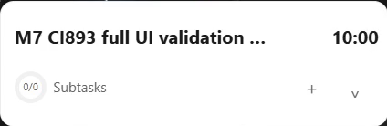
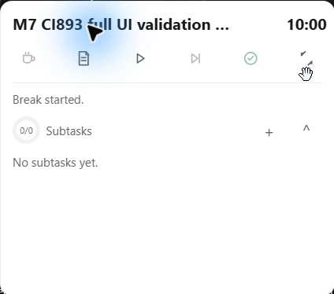
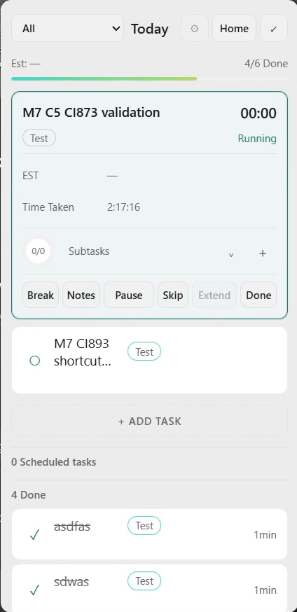
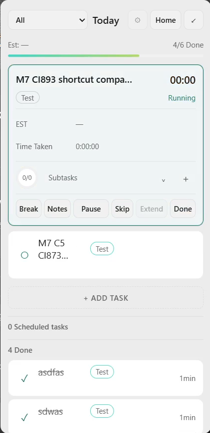
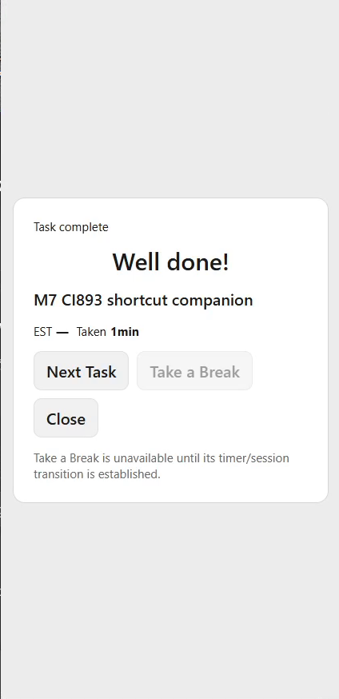
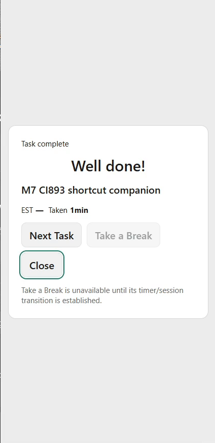
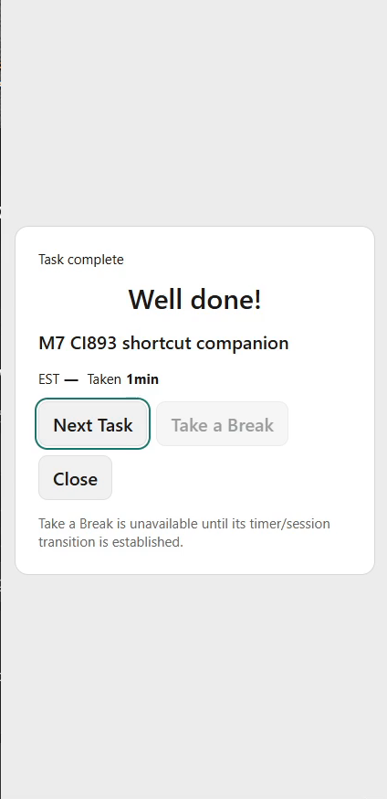

# M7 PR #225 correction and CI #893 shortcut follow-up

Current source checkpoint: PR [#225](https://github.com/MariosGiannakaras/Narro/pull/225), exact head `4f9d03832743f3db90d0c61dc527b27a194886fd`, full Windows CI [#911](https://github.com/MariosGiannakaras/Narro/actions/runs/37150284172) in progress. CI #909 was cancelled before completing validation when a newly observed Preferences failure was incorporated. It is not a physically failed build.

Four visual corrections implement the alternatives recorded in the [CI #893 physical batch](2026-10-03-codex-m7-ci893-physical-batch-evidence.md): remove the neutral transformed Timer containing block; atomically establish initial prepaint clipping before native expansion; bound Notes toolbar tooltips at both editor edges; reserve a second action row in narrow planning cards. The same Focus host and Notes editor DOM remain. Full frontend preflight, Rustfmt and 38 rendered light/dark normal/reduced cases PASS locally. The fixture now uses the production Timer wrapper and deliberately wraps the presentation button to the left. This is automated evidence; new-source physical acceptance is pending.

## Additional real CI #893 test

Same EXE `01dd602454f10f85aeecd53eb1bfcdd53368b2eec46fa60cfb5d5cf80385018b`, PID18520, Focus393640. Single DISPLAY2, 1920×1080,125%. OBS recorded continuously from `19:40:37.631Z` to `20:01:33.364Z`, including operator/analysis idle. All video and audio packets are preserved in four [full video parts](evidence/m7-ci893-followup-20261003/video), with [hashes/packet provenance](evidence/m7-ci893-followup-20261003/video-provenance.json), [complete updated logs](evidence/m7-ci893-followup-20261003/Narro-M7-Logs.zip), [UIA observations](evidence/m7-ci893-followup-20261003/observations) and [read-only ledger](evidence/m7-ci893-followup-20261003/task-ledger.json). The long idle intervals are retained, not exhaustively visually inspected.

| Observed path | Result |
|---|---|
| English physical Create from compact → Today companion | PASS; dedicated companion created once |
| English physical Break from compact, return with Pause/Resume | PASS;10-minute break, returned to paused08:11 |
| Greek physical Break from expanded, return | PASS; same work time preserved |
| Greek physical Done with success screen disabled | PASS for current Narro behavior:491-second task completed, original queued C5 test task automatically started |
| Greek physical Skip → companion, Pause | PASS; companion ran19 seconds, paused; original test task retained8279 cumulative seconds |
| English physical Done with success screen enabled | PASS;19 seconds persisted, full success card appeared on Panel, next task waited for explicit action |
| Success Tab→Close→Next Task, Escape | PASS; visible focus contained and card closed |
| First success-screen Preferences save | FAIL: UIA exposed `[PREFERENCE_SETTINGS_FAILED] ... database is locked`; no success was claimed. Retry succeeded |

The original C5 test task briefly auto-started after success-disabled Done and accumulated43 extra seconds before Pause/Skip. Historical C5 acceptance remains immutable; this follow-up does not rewrite it. The dedicated CI893 task completed with exactly491 work seconds and companion with19; neither became00:00. The `Taken 1min` celebration label uses its existing rounded display; the stored duration remains19 seconds.

The newly observed Preferences failure reopens its narrow M8 concurrent-persistence acceptance. PR #225 acquires an IMMEDIATE SQLite writer reservation before reading the current Preferences JSON. The failure is consistent with a deferred read-to-write upgrade competing with another writer; the exact competing connection was not instrumented. [SQLite transaction semantics](https://www.sqlite.org/lang_transaction.html) support the selected correction. A two-connection Rust regression holds an unrelated pending write, requires the preference patch to wait before reading, then checks that both fields survive. Exact Windows CI executes this regression; local Rust linking is unavailable. No new renderer polling, broad storage rewrite or timer-authority change was introduced.

The success-screen `Take a Break` control remains explicitly unavailable under the existing source-ambiguity disposition; this test does not resolve its product semantics. The complete English/Greek search/global/no-op matrix, missing second-monitor crossing/reconnect, fullscreen and formal M1 Candidate B tests are not implied PASS.

## Video-derived native frames

