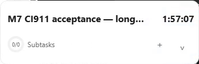
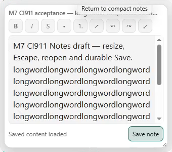
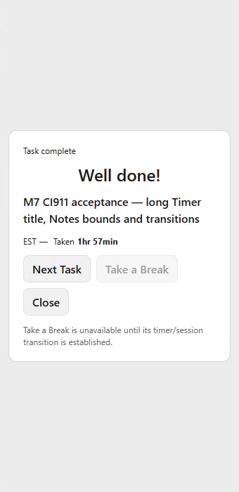
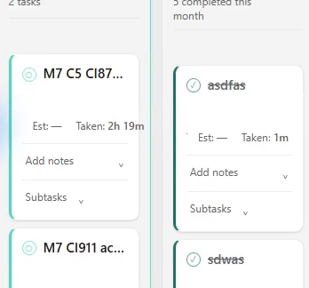
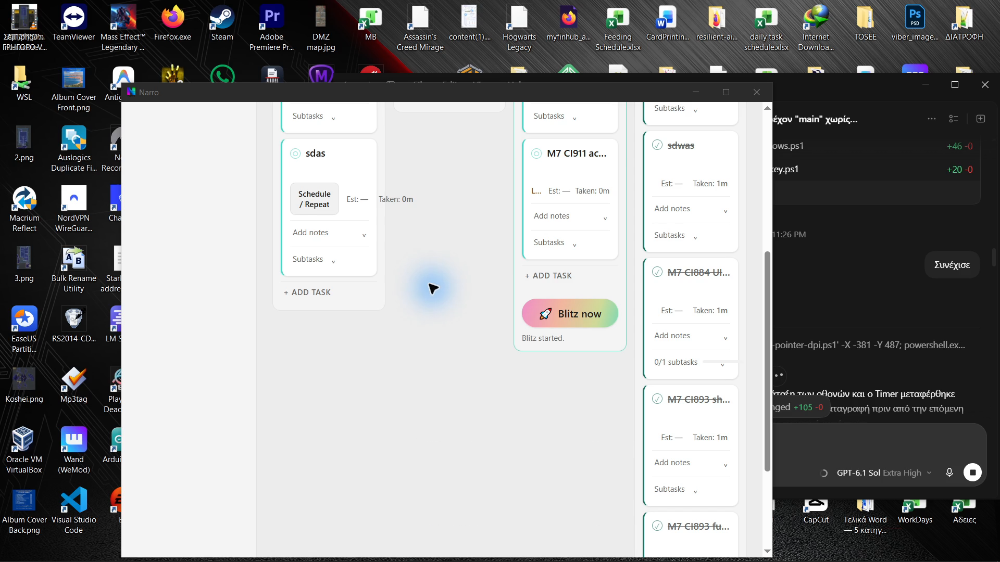
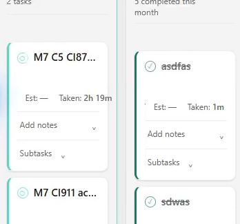

# CI911 real Windows results and PR228 corrective boundary

## Verdict

**C5 saved-placement restart PASS on exact CI911. C4 transition continuity FAIL. M7 remains 3/5.** Real interaction, decoded video frames and native/domain observations agree on the accepted paths below. This is not an all-interface PASS or Blitzit source-parity certificate.

Exact source `4f9d03832743f3db90d0c61dc527b27a194886fd`, [Windows CI911](https://github.com/MariosGiannakaras/Narro/actions/runs/37150284172), artifact `11284371032`, `narro-m7-validation-windows-x64`, EXE SHA-256 `24b71ba952ff323647537465f4d5ec8026b3e8001f65d3798d0dbf9eef06541a`. Guarded merged source `cbbaaa25dc94ec756e8bffbc731b99a8be0c4945` has identical non-Markdown content. Newer M5 PR227 changes are not validated by this older EXE.

Primary DISPLAY1: 2560×1080, 100%, origin `(0,0)`. Secondary DISPLAY2: 1920×1080, 125%, origin `(-1920,0)`. Both were restored and exercised. Single persistent Focus HWND identity is retained within each process; a new process after Quit correctly has a new HWND.

## Reproducible evidence

- [Whole frozen native folder](evidence/m7-ci911-20261004/Narro-M7-Logs), [whole-folder ZIP](evidence/m7-ci911-20261004/Narro-M7-Logs.zip), [latest native C5 PASS](evidence/m7-ci911-20261004/Narro-M7-Logs/m7-c5-latest-result.json).
- [Artifact provenance](evidence/m7-ci911-20261004/artifact-provenance.json), [all 2329 file hashes](evidence/m7-ci911-20261004/manifest.json), [original video provenance and binary parts](evidence/m7-ci911-20261004/video-provenance.json).
- [Native/UIA/action observations, initial125%](evidence/m7-ci911-20261004/initial-125), [resumed dual-display run](evidence/m7-ci911-20261004/resumed-dual).
- [33 consecutive-frame sequences /1980 PNG frames /66 dense contact sheets /33 derived MP4 clips](evidence/m7-ci911-20261004/motion/index.json). Decoded frames are source video evidence; no separate desktop screenshots were needed for this gallery.

Four original MKVs are retained byte-for-byte as 80MiB binary parts because GitHub rejects files over100MB. Concatenate each recording's listed parts as binary bytes, then verify `rawSha256` before opening. The media frames/clips are derived evidence; raw hashes certify the originals.

Recording1 is a premature-ended 1920×1080/60fps capture, retained exactly rather than represented as a normal Stop. Recording2 is a normally stopped single-secondary capture. Recording3 is a normally stopped 4480×1080/60fps dual-display canvas, with two explicit OBS Pause intervals: `22:26:24.678→23:44:27.289Z` and `23:44:50.581→23:45:23.592Z`, total4715.622s. Those wall-clock gaps are absent from the video and cannot prove behavior. Action→PTS mapping subtracts them. Recording4 is the normally stopped unpaused dual-display C5/completion capture, `00:08:16.436→00:20:30.868Z`. The cause of the OBS pauses is not established. OBS logs are included.

Direct motion inspection covered eight named sequences, 480 consecutive frames:01,02,10,11 at125%;22,23,28,29 at100%. Every source PNG and all other sequences remain available for independent review. Idle stretches of the long recordings were not exhaustively watched. No claim is made that all1980 extracted frames or all interface states passed.

## PASS/FAIL matrix

| Check | Verdict | Observed scope / limitation |
| --- | --- | --- |
| Active compact task, qualifying drag, real tray Quit, identical EXE relaunch, visible saved Timer | **PASS** | Actual drag `(50,320)→(1150,550)` moves Timer `(0,303)→(1100,533)`,1124px; normal tray Quit at00:13:25.429Z; new PID16436; compact restore `(1100,533)` at00:14:33.396Z. Native terminal evaluator PASS. |
| Restart interruption semantics | **PASS** | Same CI911 task restored paused1:57:07,7027 durable work seconds. Downtime excluded. Read-only ledger agrees. |
| Completion preserves accumulated tracked time | **PASS** | Own CI911 task completed while paused at00:16:09.472Z;7027 seconds retained. Historical CI873 task remains8313 seconds. |
| Success dialog containment | **PASS observed** | Full340×700 Panel region; complete success controls visible. Closing returns normally. Disabled Take a Break is the already documented source ambiguity, not a newly invented requirement. |
| Panel→compact safe-origin recovery on unchanged work area | **FAIL** | At100%, expanded→Panel→compact drifts y205→255→317→394; at125%,333→445. Same task/HWND. `M7-OBS-20261004-12`. |
| Normal Expand presentation | **PASS observed samples** | Reviewed100%/125% sequences retain heading/actions during finite reveal; earlier premature tall-heading exposure is not seen in those samples. This does not override Collapse FAIL. |
| Normal/reduced Collapse continuity | **FAIL** | Both DPIs expose underlying Main/desktop instead of Timer for consecutive/sampled source frames. At125% sequence02 frames43/44 PTS~351.793/351.810; full canvas confirms complete absence. At100% sequence23 frames42–44 PTS~158.743–158.776; reduced sequences11/29 also contain absent Timer frames. `M7-OBS-20261004-13`. |
| Large Notes containment, draft/resize/reopen/Save | **PASS observed** | Whole324×284 editor inside340×300 at100%;405×355 inside425×375 at125%. Real resize/draft/Escape/reopen/Save, toolbar and Save reachable. Long unbroken text wraps; intentional editor vertical scrolling is retained; no horizontal document overflow observed. |
| Wrapped tooltip | **PASS observed** |125% keyboard tooltip186×33 fits its editor boundary; no earlier left clipping in the exercised state. This is scoped to the recorded tooltip path. |
| Mixed-DPI crossing | **PASS observed** | Physical pointer crossing retains same Focus HWND/task,100%340-wide and125%425-wide geometry, then returns safely to primary. Initial old-helper DPI mismatch was a harness no-op, corrected before counting the real action. |
| Selected monitor and Left/Right Panel placement | **PASS observed** | SecondaryLeft(-1920,0),Right(-425,0); primaryLeft(0,0),Right(2220,0). Preference takes effect on next Panel entry. |
| Software topology removal/recovery | **PASS observed** | Secondary was actually disabled; Timer recovers to primary `(0,303)`. Both displays restored through observed enumerated Windows mode. Physical cable removal was not run; separate M1 Candidate B protocol remains open. |
| Always-on-top | **PASS observed** | Timer above owned local WinForms maximized and borderless full-screen probe. Exclusive full-screen is not claimed. |
| Preferences save and restart | **PASS observed** | Seven actual Success-toggle writes;On survives same-EXE restart. OriginalOff restored through UI. Two-connection contention is CI domain evidence, not an instrumented physical simultaneous-writer test. |
| New M5 source parity / narrow cards | **OPEN for latest source** | Older CI911 narrow-title/edit path was observed; PR227 changes require a newer exact EXE. No blanket M5 closure here. |
| P3-M7-01 compact hover / P3-M7-02 shell | **OPEN for PR228** | CI911 predates these corrections. Eight local rendered pointer/keyboard scenarios PASS, but exact-EXE hover/motion/canonical comparison remains required. |
| Fresh replacement-host CPU/RAM and formal M1 B/C/D | **NOT RUN in CI911 batch** | Historical CI893 production measurements remain historical. They do not replace a new-build or Candidate B measurement. |

## Video-derived gallery for visual review

The same compact task after real Quit/relaunch, paused and restored exactly at `(1100,533)`:

Large Notes at100%, native-scale source frame:

Completed paused task and full-height success surface:

FAIL:100% Collapse exposes underlying planning cards where the Timer should remain. This is not an editor scrollbar or recording Pause:

FAIL:125% Collapse full-canvas frame proves absence outside the target crop as well:

Reduced-motion absence is independently visible at both DPIs:

## Corrective decision and next exact-build gate

`M7-OBS-12` is caused by size-dependent saved-placement normalization on an unchanged work area. PR228 preserves the saved safe top-left there and keeps normalized/clamped recovery for actual changed areas. Controlled tests cover six restore loops at both DPIs.

For `M7-OBS-13`, cached compact-origin snapback after native clipping explains a risky bottom-edge move at125%, but does not alone explain100% disappearance without a coordinate change. The old path unconditionally called native setPosition/parent-position notification even when coordinates were unchanged. The exact rendering cause remains an inference pending comparison.

Alternatives were documented before the corrective edit: **A**, retain cached snapback, physically FAIL; **B**, collapse in place at the last safe clamped origin and omit redundant parent moves; **C**, introduce a compositor/native clip-move transaction with substantially more synchronization and no evidence yet that it preserves WebView2 pixels. **B is the scoped experiment selected for PR228.** Bottom-edge snapback is not confirmed Blitzit behavior; this is an explicit local reliability decision. The persistent HWND/WebView, finite renderer barrier and serialized coordinator remain intact. Source/CI PASS cannot prove the native failure fixed.

[PR228](https://github.com/MariosGiannakaras/Narro/pull/228) final head `a6af4ef15bd827ad751b023df21ab64e565e2c8e` additionally implements routed compact hover/focus grammar and16px shell calibration. Local full frontend preflight, Rustfmt, fixture geometry and eight real headless Edge hover/keyboard cases PASS. Final [Windows CI932](https://github.com/MariosGiannakaras/Narro/actions/runs/37167015466) is in progress; intermediate CI929 was cancelled, not accepted. No local Rust compilation PASS is claimed because MSVC link.exe is unavailable.

Next: exact-head Windows PASS and guarded merge, hash-verified artifact, continuous100%/125% normal/reduced bottom-edge/direct/Panel transitions, stable hover/action labels and keyboard/Notes, drag→actual tray Quit→same-EXE restore, refreshed idle measurements and direct canonical comparison. M1 formal protocol remains separate. M7 closure stays3/5 and global3/10M; no counter closes from this known-failing capture.
