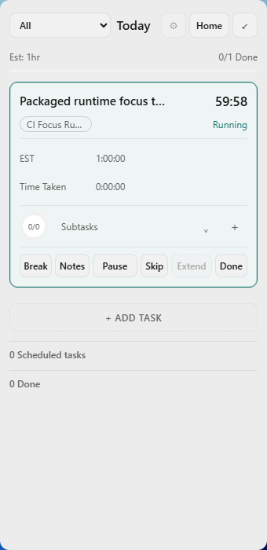
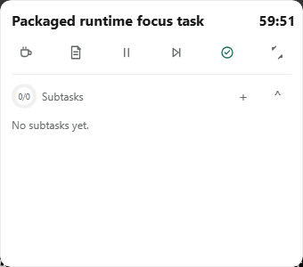

# CI #893 final corrected M7 candidate

[Windows CI #893](https://github.com/MariosGiannakaras/Narro/actions/runs/37134207962) **PASS** on PR #222 exact head `549536c4d19b0045a928652d3feff53162f55a6e`. Expected-head guarded merge: `ccf0fef5554fe8b635807df9214d56d3b2c29457`. [Blob/tree proof](main-tree-proof.json): zero non-Markdown differences, including build/tests/workflow. Duplicate main CI #896 was cancelled; the exact-green PR artifact is the corrected resulting-main source candidate.

| Identity | Value |
|---|---|
| Artifact | `narro-m7-validation-windows-x64`, id `11278482082` |
| Downloaded ZIP | `5279271` bytes |
| ZIP SHA-256 | `fa44946aa463eaf5e307524ec19dacc5dd09c51b6c16678f75e7977521631020` |
| EXE | `narro-m7-validation.exe`, `15027200` bytes |
| EXE SHA-256 | `01dd602454f10f85aeecd53eb1bfcdd53368b2eec46fa60cfb5d5cf80385018b` |
| CI/logger fingerprint | `fnv1a64:be808f7e43e80ccb:bytes:15027200` |
| Local candidate | `E:\SystemFiles\Desktop\NarroUpload\artifacts\m7-pr222-ci893\candidate\narro-m7-validation.exe` |
| Locally launched / physical acceptance | **NOT RUN** |

ZIP hash matches GitHub's artifact digest; extraction was bounded to the candidate directory and the EXE was independently hashed. CI's automatic logging smoke PASSed; its initial evaluator is **PENDING**, as expected before real drag/restart observation.

Full Windows gates passed: fast frontend/contracts/build/Rustfmt, Rust compile/Clippy/tests, harness self-tests, all visual regression captures including the 30 affected explicit normal/reduced cases, release build, packaged Focus runtime, physical-validation build/boundary, automatic M7 logging smoke and M1 diagnostic storage-isolation smoke. Actual physical idle CPU/RAM is not a harness self-test.

The full packaged runtime artifact is preserved under `runtime-visual/`; its validator PASSed again locally. The settled Panel and expanded Timer PNGs below were visually inspected. CI's Panel at 96 DPI reports outer and client both **340×700**, region **340×700**, no root/document overflow and complete stable action labels. Its runtime environment reports reduced motion. This is automated Windows evidence; it does not certify physical 125% framing, both monitors, normal compositor motion or same-EXE C5.

Use [the affected physical batch](../../2026-10-03-codex-m7-pr222-affected-physical-batch.md) in a fresh Computer Use control turn. Current corrective progress **3/5**; M7 remains OPEN. Original CI #873 exact-build C5 PASS and [CI #884 complete physical logs/video/findings](../../2026-10-03-codex-m7-ci884-physical-batch-evidence.md) remain separately preserved.

[Artifact metadata](artifact-metadata.json), [CI metadata](ci-metadata.json), [candidate identity](candidate-identity.json), [full CI log](full-ci-log.txt), [final local rendered evidence](../m7-pr222-final-local-20261003/README.md).
