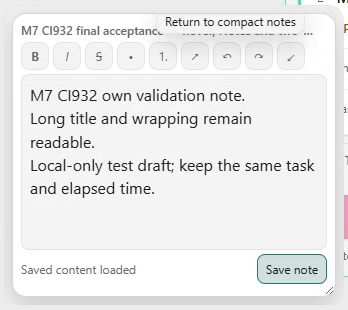
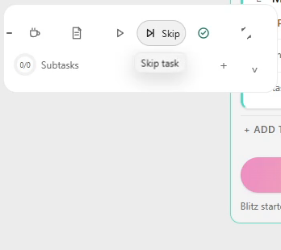
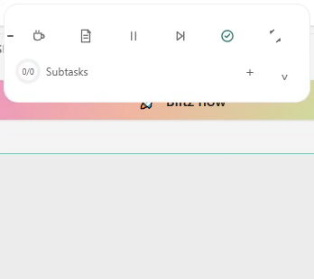
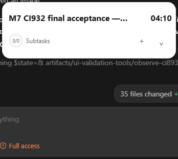
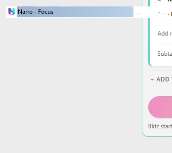
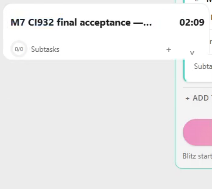
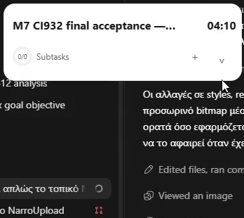
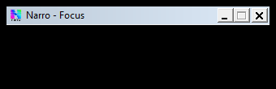
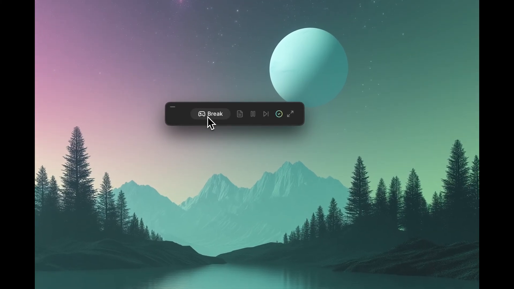

# CI932 direct visual review

This document records the limits of actual inspection. The123 sequences/8100 exported PNGs are available for independent review; they are not123 accepted tests. Directly inspected ranges are machine-readable in `visual-review-ranges.json` (1050 frames, counting the separately exported live failure sequence). Contact sheets retain consecutive frames; diagnostic controls/held captures are distinct from the unmodified production run.

| Criterion | Result | Direct evidence |
| --- | --- | --- |
| Native Collapse image continuity | **FAIL** | Original live sequence001–060: classic caption044–049; partial returned content050; compact051. Same HWND/position does not imply painted continuity. |
| Style/repaint/DWM alternatives | **Rejected** | Style24/30/36/42 whole60; repaint54/59/65 second30; DWM71/83/89 second30 and77 whole60. Child redraw can replace caption loss with complete Timer absence. |
| Composition alternative | **Not executed** | COMPOSITED forbidden onCS_OWNDC class; NOREDIRECTIONBITMAP did not survive readback. Onlycontrol captured. |
| Native temporary child180ms | **Diagnostic pixel retention; release FAIL** | Control101 second30; held107 whole60 and109/111 second30: preserves pixels at native boundary, partial incoming hierarchy on release. |
| Native temporary child500ms | **Diagnostic pixel retention; product still OPEN** | Corrected OBS start06:28:23.404Z;119/121/123 each whole120. No caption or whole Timer absence in these ranges. Frozen outgoing expanded hierarchy, controls fading/partial on release mean it is not a motion PASS. This specifically motivates prepainting compact content before retaining pixels in PR230. |
| Parent-client DC capture | **Rejected as production input** | `own-hwnd-client-dc-probe.png` returns classic caption/black rather than actual displayed Timer. It proves stale GDI capture, not an exact DWM root cause. PR230 uses own-WebView2 CapturePreview. |
| Saved placement/C5 restart | **PASS exactCI932** | Twelve100%/125% normal/reduced Panel returns; actual378.8px drag, tray Quit, same fingerprintEXE relaunch, explicit shortcut reappearance1466,638, paused04:10/250durable seconds; full native evaluator/session logs. |
| Source hover | **OPEN** | Real six-action hover captured; VE003 gamepad discrepant with coffee glyph. PR230 corrects glyph, native/source retest pending. External shadow is still an unresolved explicit reliability deviation. |
| Formal M1 B/C/D/idle performance | **NOT RUN CI932** | Requires isolated diagnostic and quiet measurement on corrected exact build. |

The final freeze tray Quit occurred after diagnostics, without OBS; it only stops log writers. `pending-c5.json` describes a possible next round trip and is not an additional completed PASS. RecordedC5 PASS is preserved unchanged. Software topology checks and current-EXE/source-motion acceptance remain separate.

## Video-derived gallery

Images below are decoded from OBS video, except the explicitly labeled parent-DC/canonical-source probes. Their metadata lives in `gallery/provenance.json`. These are representatives; consecutive-frame ranges determine animation verdicts.

### Large Notes bounded presentation; full draft/focus/Save proof also uses observations and recorded actions.

### Compact Skip hover; selected label with neighboring slots stable.

### Running own task after378.8px physical compact drag, at1466,638.

### Same task restored paused04:10 after same-EXE restart and explicit Timer shortcut.

### Observed native classic caption instead of Timer; official Collapse FAIL.

### First returned compact pixels after the caption gap; actual source frame051.

### Modified-runtime500ms bitmap child: diagnostic only

### Parent-client DC probe: stale caption/black

### Canonical VE003: Break gamepad

