# CI936 direct Windows and source review

Exact production EXE SHA256 `4136582562a19aaa2fbd0cd2a67c49b4353117186a66be41fa84cb4968311a78`, source `ff21477e57b42b7e672b439625db6e9a20abb152`, full Windows CI936/run37184564836. The later M6 Notes/entry changes and PR231 diagnostic corrections are distinct source and require their affected checks.

| Criterion | Verdict and evidence |
| --- | --- |
| Collapse continuous painting | **PASS for inspected matrix paths**:1800 unique consecutive frames over all nine DPI/motion/placement contexts plus a second100% normal cycle. No caption or complete Timer absence. All18 native Collapse steps completed; 3240 frames locator-screened, all11 flags inspected. Export count is not manual review count. |
| Expand and Panel↔Timer | **PASS exercised paths**:240 Expand boundary frames,300 unique Panel/restore frames, including whole moving path. Same Focus HWND1247064. Native matrix27 Panel returns preserved paused250 seconds and safe positions; edge expansion is clamped rather than snapped off screen. |
| Compact source structure and hover | **PASS observed grammar**: title/time at rest, Subtasks ring/row, conditional six-action strip, selected labeled pill, canonical VE003 Break gamepad and short drag line. Six actual hover captures, unchanged native button target rectangles. SS-C20/SS-H09/VE003 compared directly. Exact theme and pixel equality are not claimed. Rightmost `Focus` label is a documented Narro inference for the source icon. |
| Native external shadow | **Intentional Windows reliability deviation**: exact images lack the source exterior shadow. The native region and DWM frame removal avoid the physically demonstrated classic-caption/inset/client-offset failure. CSS cannot paint outside the native region. Retain reliable frameless host and rounded silhouette; do not claim exterior-shadow source parity. No architecture rewrite is required for this cosmetic deviation. |
| Large Notes/input | **PASS exercised bounds**:100% normal324×284 and125% reduced405×355 stay within native300/375px presentation. Outward resize is clamped; inward resize leaves Save and keyboard/Escape reachable. Editor-local scrollbars for long content are intentional; no document scrollbar was observed. Four-line draft survives Save/restart. |
| Finite native bitmap child | **PASS observed input/lifetime**: physical pause/resume and Break pointer work while child is alive; child gone by1800ms, sampled GDI24→24/USER46→46. No UI-thread wait or separate timer authority. |
| C5 and timer integrity | **PASS exact936**: actual~2986px final drag, normal tray Quit, same EXE relaunch, explicit Timer reappearance1280,616, same task paused325 durable seconds, completion retains325. Evaluator maxMoveDistance3254 covers the whole session, not just final drag. Accepted result is frozen separately; final ordinary Quit is not a second completed round trip. |
| Formal diagnostic B | **FAIL original936, correction in PR231**:2/4; requested monitor conflicts with persisted preference during DPI recovery. Preference-matched product path reaches secondary125%. Historical failure retained. |
| Software topology | **Recovery observed**: same diagnostic process/Focus survives2→1 and1→2. Windows LG idle state resisted Extend alone; user-provided Duplicate→Extend succeeds09:03. Fresh UI selection confirms primary100%/secondary125%. Reconnect occurs after OBS stop and is supported by native/UI observations, not this recording. Physical cable/sleep-wake was not performed. |
| Idle performance | **Valid three-run936 measurement using repaired PR231 collector**:CPU run averages0.05185%,0%,0% of one core; working sets404.122,403.874,403.855MiB; private bytes311.101,310.789,310.754MiB; no churn, Main absent. Similar to earlier CI893404–409MiB, no unexplained resident regression. Shared pages are summed; private committed memory is reported separately. No post-hoc numeric threshold. Final942 executable not measured by these files. |

`visual-review-ranges.json` records2340 unique consecutive frames directly examined. There are6480 compact/expanded exports and960 Panel exports; uninspected portions remain available. Gallery images below are decoded from the existing OBS video, not a second screenshot session. Contact sheets are review aids; full lossless union crops retain the moving host between endpoint ROIs. PTS mapping uses OBS UTC and includes capture-scheduling uncertainty, so it does not establish sub-frame animation durations.

### large-notes-100

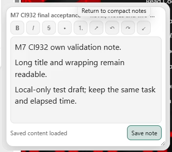

### large-notes-125-reduced

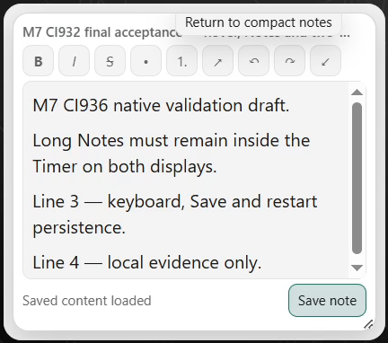

### notes-resize-min-125

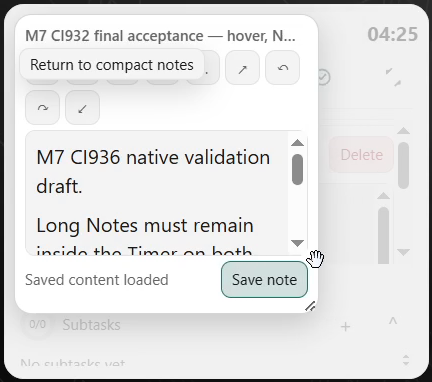

### c5-before-quit

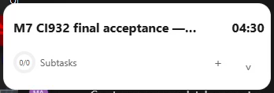

### c5-restored

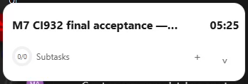

### notes-after-restart

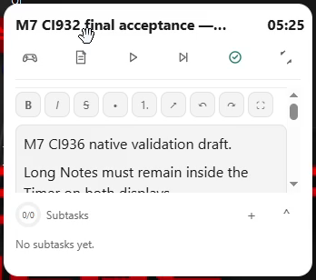

### hover-0

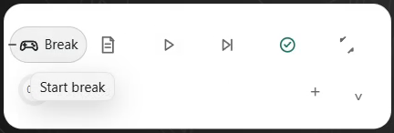

### hover-1

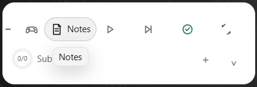

### hover-2

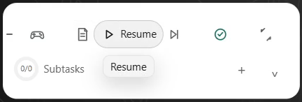

### hover-3

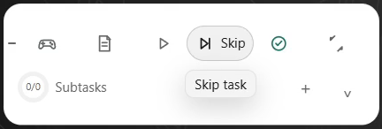

### hover-4

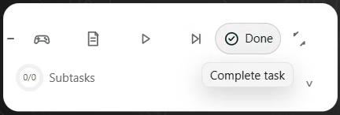

### hover-5

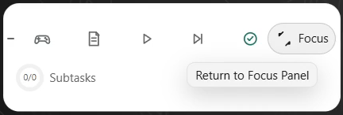

