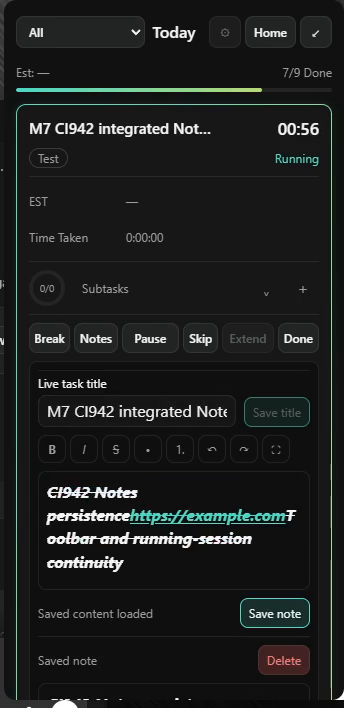
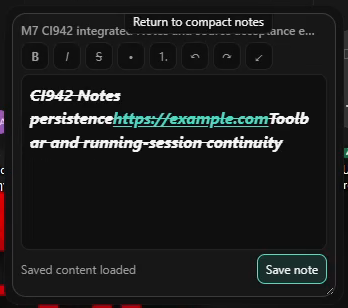
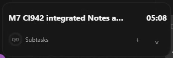
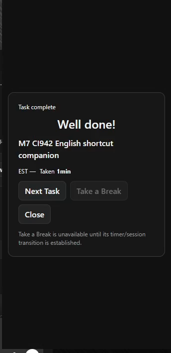
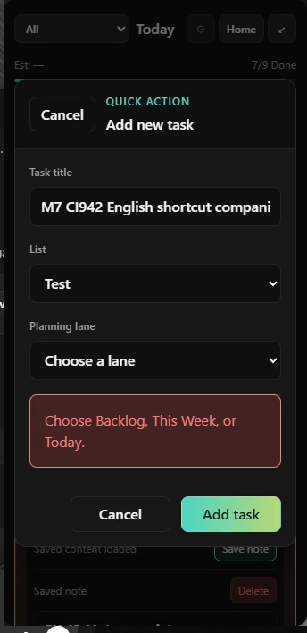

# CI942 complete physical Windows evidence

**Scoped native C5 / placement / software topology / quiet performance: PASS. Modal shortcut isolation: FAIL (`M7-OBS-20261004-17`), corrected by PR232/CI944 with physical retest still open.** This package does not claim whole-milestone or whole-source-parity acceptance.

[Detailed results and cross-milestone dispositions](../../2026-10-04-codex-m7-ci942-physical-results.md) · [Machine-readable visual review](visual-review-results.json) · [Complete native logs](Narro-M7-Logs) · [Whole log ZIP](Narro-M7-Logs.zip) · [Per-file SHA256 manifest](manifest.json).

Production source `c2821e6f998c6cd7424d5aed8673f5c9a3ff9e9d`, PR231, full Windows CI942/run37191346390; identical-source merge `416ff40ecd6c50b660ecfef9c9c0b57c2dc7dd92`. Exact production EXE SHA256 `3e836e942b45f3586e71bda15208f60b8b8cc901449146fdef76b8999b5b61ea`. Diagnostic SHA256 `89b2c7c6799743e891a8c602c0e969aab8d0ecdd6b64a809c453f44e567af648`. [Native build provenance](provenance.json).

## Video for direct review

The complete original OBS recording is preserved without transcoding: **4480×1080, 60fps, 2722.867 seconds**, both displays side by side. [Original hash, stream metadata and ordered parts](video-provenance.json). Git-size-safe 40MiB parts retain every original byte/audio stream. Run `python reassemble-video.py --output PATH` after downloading the whole package; both parts and reconstructed SHA256 are verified before publishing the output.

Convenient playable excerpts, derived from that same recording:

- [Notes toolbar, save and live title edit](review-clips/notes-toolbar-and-live-edit.mp4)
- [Confirmed modal/background shortcut failure](review-clips/modal-shortcuts-background-action-failure.mp4)
- [Both displays: drag, tray Quit, relaunch and restored Timer](review-clips/c5-dual-display-drag-quit-relaunch.mp4)
- [Finish from compact Timer → complete full-Panel success](review-clips/compact-finish-full-panel-success.mp4)

[Clip provenance](review-clips/provenance.json) distinguishes cropped re-encoded previews from keyframe-aligned stream copies. The original and lossless PNGs remain the acceptance reference. Direct inspection covered **600 unique consecutive source frames across five PTS ranges**, exported into seven Main/Focus/Timer ROIs (**840 PNG exports**, paired views counted once), plus six native-observation-aligned PNG stills. The entire 45-minute recording was not manually inspected. OBS logged202 render-lag frames/32 encoding skips; encoded frames are not assumed to be unique physical refreshes.

## Video-derived gallery

The Notes editor preserves the current source toolbar grammar and recognizes the saved URL. This narrow comparison does not establish every queued/live Notes state as source-parity-complete.

Large Notes editor at100% reduced motion; editor and Save stay inside the expanded Timer region.

The same EXE relaunches and restores the same task paused05:08 at `(1330,613)`.

Finish from compact correctly opens the full Panel before displaying success; Next Task and Close are reachable.

The Add task modal remains visible while Notes opens behind it in the failing CI942 build.

[All stills and timestamps](review-stills/index.json) · [Consecutive-frame ranges/contact sheets](motion/index.json) · [All observations](observations) · [Actual UI action diary](actions.jsonl).

`observations/compact-success-navigation-crop.png` is retained as a raw navigation mistake: it captures Codex, and is excluded from acceptance/gallery claims. Window host700/875px height is distinct from compact110/138px native region height. Navigation screenshots do not substitute for motion evidence.

## Measurements and limits

[Three exact-CI942 quiet runs](performance/batch-summary.json): Main destroyed, one compact Focus, OBS closed,30s warmup/60s sampling, all native preflights/hash checks valid, zero churn. Median CPU0.025896% of one core,399.420MiB summed working set,333.006MiB private. [One matched cold CI936 comparison](performance-cold-baseline-ci936/summary.json):399.266MiB working/324.727MiB private,0.025999% CPU. The bounded2.55% private difference is documented in the detailed acceptance decision; no long-duration leak test is claimed. Performance occurred after video stop and is independently logged.

Physical cable removal/display sleep-wake, M5 drag/delete/archive, M9 Reports/exports and complete Preferences/source-parity were not adequately exercised. No M10 checkbox/counter advances. Whole native logs are copied from the stopped run; neither process session is discarded. ZIP byte identity and original-video reassembly are verified.
