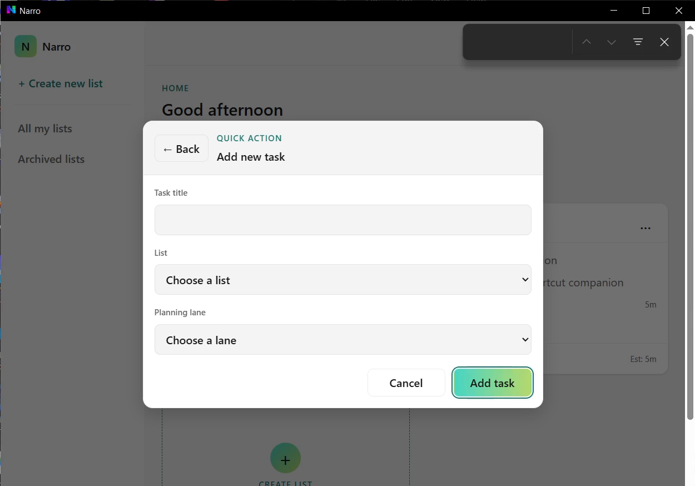
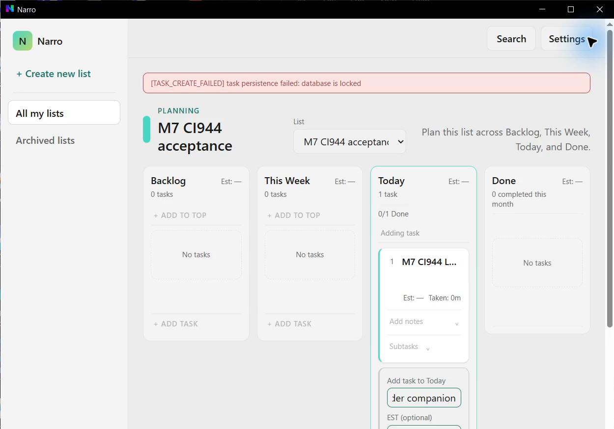
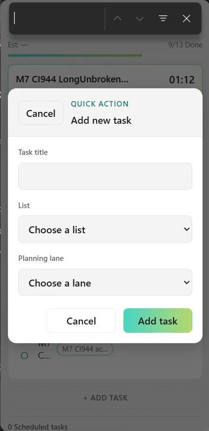
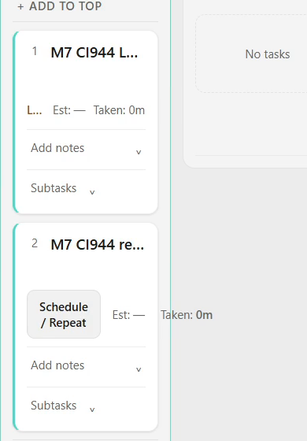
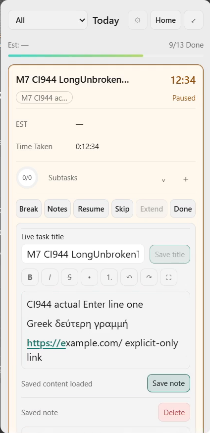
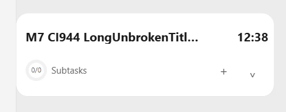
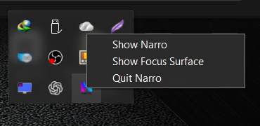
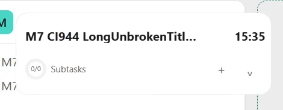

# CI944 complete physical evidence

This package preserves the **complete original recording**, **all 11 Narro-M7-Logs files** (including both processes and pending/terminal evaluator records), raw input/state observations and a directly inspected video gallery. [Detailed result and M1–M9 disposition](../../2026-10-04-codex-m7-ci944-physical-results.md).

CI944 / PR232 exact source `6029b5529f025c8dffb4e05331e11a6bbcbb4bec`, identical merge `0df4c14cfa6fa8632cff49529ddc36510d67ddd3`, artifact11302770897. EXE SHA256 `b6814cf572e89c0d738659726d2fa1fc06cda1dea65721f4cb1f6d04900439fa`.

OBS normal Start/Stop UTC14:25:24.311–15:11:41.970; 4480×1080/60fps, 2777.087s, 157799345 bytes. **Only LG1920×1080/125% was active**; the unused second source is black. This recording does not prove dual-display or sleep/wake acceptance.

- [Whole native logs](Narro-M7-Logs/) and [byte-identical whole-log ZIP](Narro-M7-Logs.zip).
- [Native C5 PASS](Narro-M7-Logs/m7-c5-last-pass.json): running compact Timer, 522.015px actual drag, normal tray Quit, absent old PID, same-SHA relaunch, same task/session paused15:35 at `(396,745)`.
- [Original video parts and hashes](video-original/parts.json): concatenate four numbered parts using the [verified reassembler](video-original/reassemble.py), e.g. `python video-original/reassemble.py --output /your/new/path/original.mkv`. The complete output was actually reconstructed and checked: SHA256 `b5b0ed21a93a0223ef3daa0aa420876ecdb20eb44e1fb37cf5f238a39e9b31d9`.
- Original-stream-copy playable excerpts: [Main modal/Find](clips/main-modal-find.mkv), [locked create and successful retry](clips/create-lock-and-retry.mkv), [Focus modal matrix](clips/focus-modal-matrix.mkv), [C5 drag/Quit/relaunch](clips/c5-drag-quit-relaunch.mkv). These retain original streams; seek bounds follow original keyframes.
- [Actions](actions.jsonl), [raw observations and navigation captures](observations/), [OBS original log](obs-original.log), [pre/post cross-gate inventory](inventory/), [provenance](provenance.json).
- [Machine-readable direct review](visual-review.json), [gallery timestamps/crops](gallery/index.json), [package manifest](manifest.json).

The final gallery below is exported losslessly from the original video. Navigation GDI images remain in observations for lineage. **240 unique consecutive frames** were directly inspected across [retained Find/modal](review/focus-find-appearance/index.json) and [compact destination arrival](review/compact-entry/index.json), plus eight gallery stills and five full-LG companion stills. The whole 46-minute recording was **not** frame-reviewed. Find is already present at the first frame of its range. The first 20 compact destination frames precede Timer arrival; they are not blank-Timer failures. The destination crop and five companion stills do not prove uninterrupted whole-path C4 continuity.

## Confirmed failures

Native Chromium Find escapes the Main Add modal (PTS186):

Actual named creation returns database-is-locked (PTS1053.5). The explicit retry later commits exactly once:

Native Find also escapes Focus modal (PTS1735.8):

Schedule/EST/Taken overflow a narrow planning card into its neighbor (PTS1735.8):

## Notes and native C5

Actual physical Enter creates three note lines, including Greek and an explicit-only URL (PTS2455); saved bytes survive restart:

Running compact Timer after the qualifying drag (PTS2521.5):

Actual normal tray menu/Quit path (PTS2696):

Same-EXE paused Timer restored at the saved position (PTS2737):

Modal action routing17 passes its exercised direct/delivered English/Greek paths. Findings18/19/20 remain physical FAIL until corrected-build retest. Earlier exact CI942 acceptance is preserved only for unaffected scopes. No M10 checkbox or counter advances.
