# Whole CI948 physical evidence

[Exact results, limits and reconciled findings](../../2026-10-04-codex-m7-ci948-physical-results.md). Source28e840f5, production EXE0914b4c9, full CI948/run37220348196. Both physical displays recorded at4480x1080/60fps.

C5 actual drag/Quit/same EXE/paused restore PASS. Native modal defaults18 PASS. Notes tooltip09 PASS. Narrow metrics20 normal125% PASS. Writer19 CRUD scope PASS, lane Move acceptance OPEN. Queued title21 partially accepted; catalog22 and queue access23 FAIL. HTML5 Windows drag configuration24 requires correction; exact drag hit-target cause INCONCLUSIVE. Delete confirmation functional PASS but source container25 FAIL. M7 remains4/5, M10 blocked.

## Complete originals and logs

Both original OBS files are retained byte for byte in ordinary Git parts under40MiB (no external LFS requirement). Run each folder's `reassemble.py` to produce its playable original MKV; each part and final SHA is checked. Independent ordered concatenation was verified before publication.

- [Recording01 parts/hash/reassembly](video-original/recording-01/parts.json):96.834s,16275991 bytes, SHA9893945f00b108de34734d88e136582dc18410a823f0c7a3d9b2509c23fa7bd7.
- [Recording02 parts/hash/reassembly](video-original/recording-02/parts.json):2545.400s,387354473 bytes, SHA611b89496c0cf66e9f5f250f3669d797b0118433616da7309b93eb3e77247f18.
- [All eleven Narro-M7-Logs files](Narro-M7-Logs) and [complete byte-identical ZIP](Narro-M7-Logs.zip), including both process sessions and native C5 PASS.
- [Provenance](provenance.json), [OBS original log](obs-original.log), [actual actions](actions.jsonl), [observations](observations), [pre-session matrix](SESSION_MATRIX.md), [post-session matrix](POST_SESSION_MATRIX.md) and pre-session authoritative [inventory](inventory).

The local production database safety backup is not part of this package. Second process was alive/owned task paused at log snapshot. Complete original recordings were not inspected frame by frame in their entirety.

## Playable excerpts

Original encoded streams copied without re-encoding; keyframe-aligned clip boundaries may precede requested times. Gallery/review indexes use exact original recording02 PTS, not clip-relative timestamps.

- [Modal matrices](clips/modal-matrices.mkv)
- [Metrics and queue failures](clips/metrics-and-queue-failures.mkv)
- [Wrapped Notes normal/reduced contexts](clips/wrapped-notes-normal-reduced.mkv)
- [C5 drag/Quit/relaunch](clips/c5-drag-quit-relaunch.mkv)
- [Planning drag attempts](clips/native-planning-drag.mkv)
- [Delete and Archive](clips/inline-delete-archive.mkv)

## Video-derived visual gallery

These are lossless PNGs decoded from the original OBS recording, not separately timed screen captures. All12 images and all840 unique consecutive review frames were directly inspected; [visual review](visual-review.json) states exact limits. [Numbered frames and atlases](review) preserve motion/microinteraction evidence. A static image does not prove a transition.

### main-modal-no-native-find — original PTS 140.963s

Modal retained; complete native Main right edge contains no Find UI.

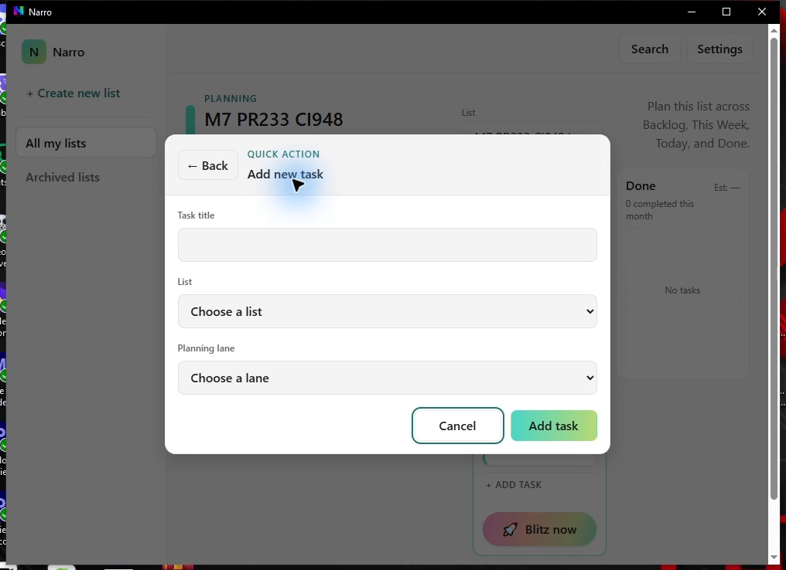

### focus-modal-no-native-find — original PTS 554.963s

Focus dialog retained after actual Greek action/default shortcut matrix; no native Find.

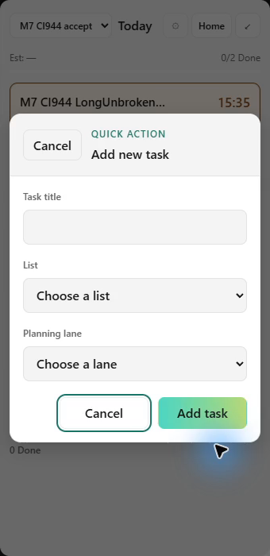

### all-queue-clipped-unscrollable — original PTS 925.963s

FAIL23: fourth All row and its actions clipped; actual wheel did not expose the remainder.

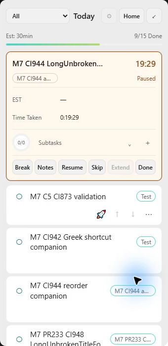

### narrow-est-editor-contained — original PTS 693.963s

PASS20 normal125%: full 185px physical card and contained EST controls/Save tooltip, unchanged geometry.

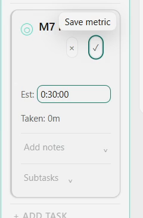

### normal-wrapped-notes-tooltip — original PTS 1261.963s

PASS09: wrapped Return tooltip appears inward, bounded by enlarged Notes presentation.

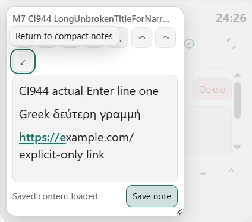

### reduced-wrapped-notes-tooltip — original PTS 1339.963s

PASS09 bounds in measured OS ClientAreaAnimation=0 context; no independent CSS matchMedia proof.

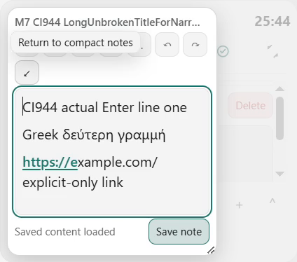

### normal-tray-quit — original PTS 1476.963s

Actual native tray Quit menu immediately before normal exit; process absence is separately observed.

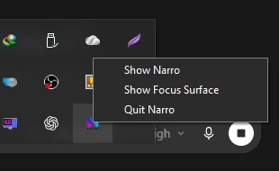

### same-exe-paused-timer-restored — original PTS 1506.963s

Actual new-process same-SHA compact Timer restored paused at saved(-1504,598).

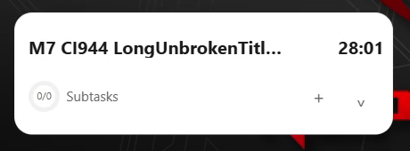

### owned-long-title-live — original PTS 1731.963s

Owned long task becomes live; title remains bounded, identity/time preserved.

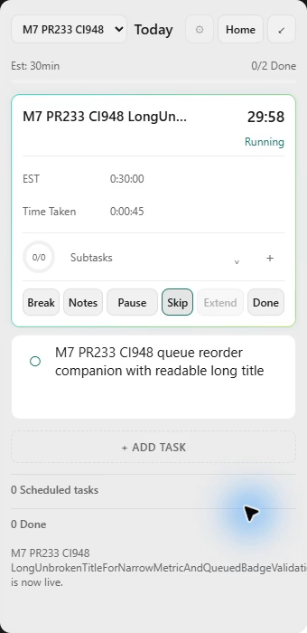

### native-planning-drag-did-not-move — original PTS 1901.963s

Owned card remains in Today. Input hit-target scope INCONCLUSIVE; independently confirmed Windows HTML5 config blocker24.

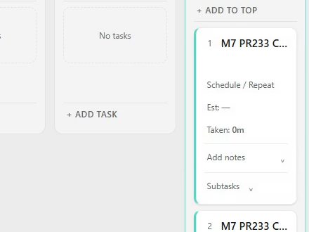

### inline-delete-confirm — original PTS 2424.963s

Functional Confirm/X works, but source placement FAIL25: confirmation appears in card rail instead of retained overflow menu.

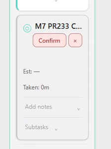

### archive-restore — original PTS 2504.963s

Owned archived-list card visible before actual Restore; action trace records restoration, whole shell parity not established.

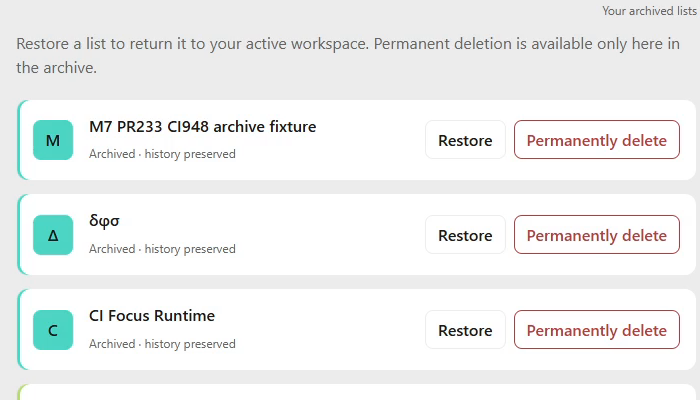

## Direct canonical-source comparison

VE00618.000s clearly retains the task menu and turns only its bottom Delete row into red trash/Confirm/X. The actual CI948 image above places confirmation in the card rail: source FAIL25 despite functional delete PASS. VE00636.000s shows direct Archive action grammar; the owned empty-list action is scoped PASS, not a nonempty aggregate count or whole Archive shell claim.

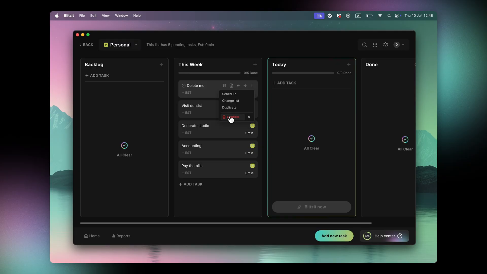

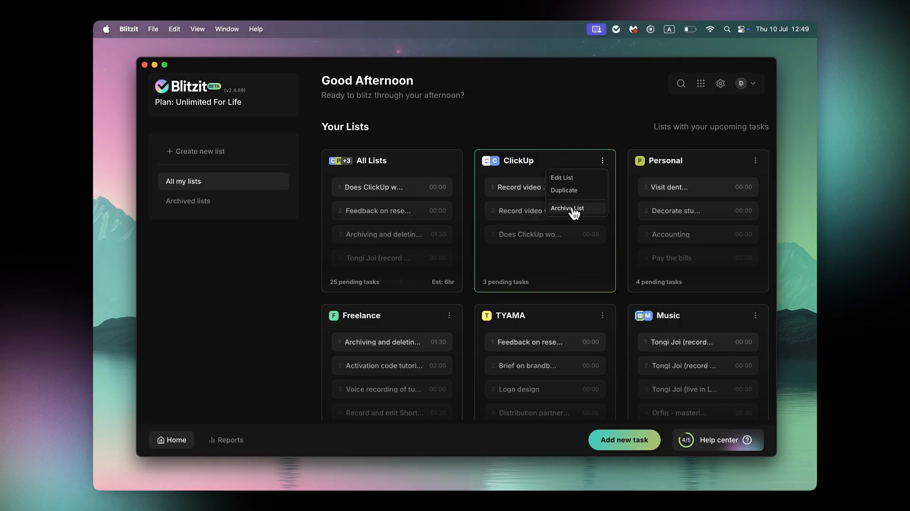
