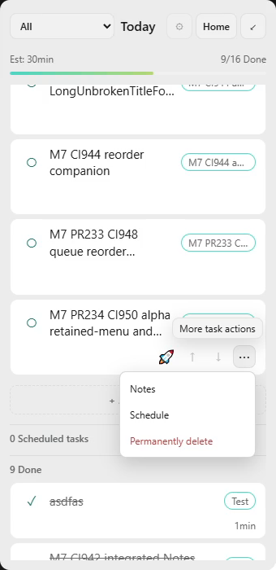
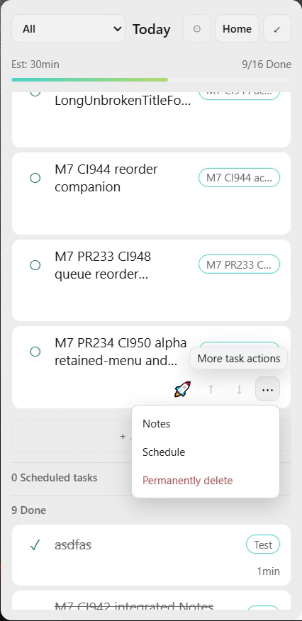
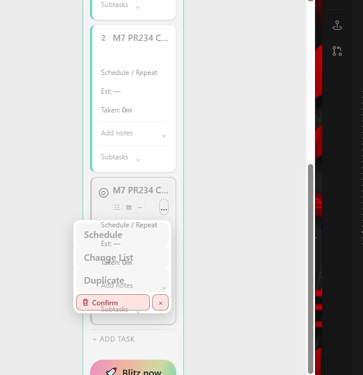

# Whole CI950 native evidence

[Results, failures, limits and M1–M9 matrix](../../2026-10-05-codex-m7-ci950-physical-results.md). Exact source704763e2 / CI950 / EXEc9189a75. Four complete dual-display4480×1080/60fps OBS originals are retained as ordinary Git40MiB parts with per-part and whole SHA256 in `video-originals/index.json`. Reassemble with `python reassemble.py OUTPUT_DIRECTORY`. Entire current six-file `Narro-M7-Logs` folder and ZIP are retained, including provenance and native display/position events; snapshot is from a still-active process.

`actions-reconciled.jsonl` preserves actual chronological inputs. Some copied PR234 helper scripts retained their older output path: relevant new-process records were recovered and explicitly labelled, without rewriting historical published evidence. `observations` contains native/UIA records, video-derived images, and clearly named GDI navigation probes. `inventory` contains read-only ledgers and pre-session tracking snapshots. Local database backups are not part of this evidence package.

Whole original frame-by-frame review is not claimed. Navigation probes and single frames cannot certify continuous motion, source parity, or a native drag/drop success. The native drag/drop and menu-painting failures remain visible and open; no M10 checkbox advances.

## Direct visual review

The menu clip is original recording2 PTS353–371s, cropped to primary and scaled1280×540. The drag clip is original recording4 PTS0–6s with the same crop/scale. Neither is a substitute for the entire originals.

[Retained menu and confirmed painting defect](menu-confirm-paint-failure.mp4) · [Verified SendInput drag failure](sendinput-native-drag-failure.mp4)

`inventory/ledger-comparison.json` separates stable-ID Move/gamma acceptance before duplication from the independent copy/new IDs retained after final owned-list deletion. The provisional after-copy-deleted filename does not identify the deleted same-named list; the final ledger proves that the original was deleted and its duplicate retained. CI948 terminal logs are an immutable addendum, not a rewrite of the earlier published snapshot.
