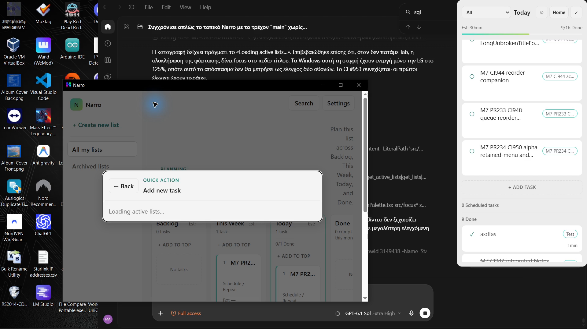
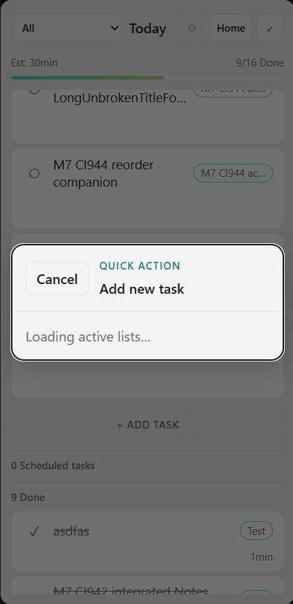

# CI950 controlled loading addendum

Exact source704763e2 / EXEc9189a75 / PID133416; Main19727316 and persistent Focus4064974. Actual keyboard input and original OBS recordings exercise a controlled real SQLite read delay. `BEGIN EXCLUSIVE` holds the current rollback-journal database for1.8s or4s, executes no data statements, and always rolls back/closes. The owned session is required paused before each exercise. No DOM/IPC result is fabricated.

**Loading feedback and ready title focus: scoped PASS. Pending keyboard responsiveness: FAIL /07 remains OPEN.** With the4s hold, Main PTS4.5 and Focus PTS8.5 still display loading after Escape was injected, before the lock is released. The shorter capture therefore cannot certify responsive loading-time Escape/Tab. Source uses synchronous `get_home_snapshot` and `get_list_board_snapshot`; moving these reads off the native event thread is the scoped next investigation, not an already-validated fix.

Only LG1920×1080/125% is active. UltraGear is unavailable in the post-session native inventory. No display topology change was performed during these captures. The inherited4480×1080/60fps OBS canvas consequently contains the1920px LG image and black unused area. No two-display/100% acceptance is claimed. The03:28:21Z attempt stopped after foreground activation was rejected; no test input was delivered in that recording.

All three entire originals are in `originals`, with bytes/SHA256 in its index. The first381.784s recording contains diagnostic gaps; whole original frame-by-frame review is not claimed. Four relevant3–4s regions were decoded at60fps (840frames);190unique cropped states were directly reviewed in all12 chronological atlases. The original remains the authority for uncropped geometry/timing. Playable excerpts: [Main Escape](main-escape.mp4), [Main retained ready focus](main-ready-retained-focus.mp4), [Focus Escape](focus-escape.mp4), [Focus ready title](focus-ready-title.mp4).

`inventory/ledger-comparison.json` proves all sampled owned IDs/sessions/time/notes, paused checkpoint and Preferences unchanged. The entire current `Narro-M7-Logs` folder and byte-verified ZIP are included; this is a still-live snapshot requiring a terminal addendum later. Archived reproduction text is evidence, not an executable repository tool.

Pre-session current-main TODO/HANDOFF/crosswalk were inspected and copied. Post-session M1: observed single-display recovery only, no new topology/performance acceptance; M2/M3: sampled identity/time preserved; M4: no scheduling exercise; M5: no new source/drag/menu acceptance; M6/M7: narrow loading/focus findings above; M8: actual Create chord exercised but no whole shortcut matrix PASS; M9: no report exercise. Other open requirements remain open. M10 counters unchanged; M11 dormant.
