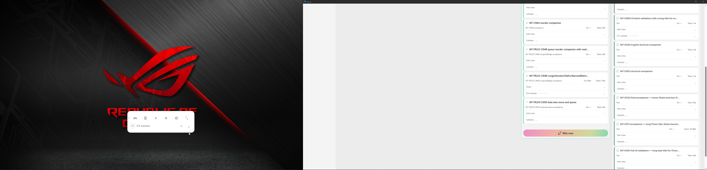

# CI953 supplemental M5/M6 Notes/dialogs and M7 bottom-edge evidence

## Current — CI953 Notes/modal/bottom-edge capture; visual review44/100

[Whole 1042.550s recording, verified multipart MKV/MP4, screenshots, whole logs/ZIP and actions](video/media-reassembly.json). M5/M6 large populated Notes attempted lower-right resize and actual Ctrl+A/Tab/Shift+Tab/Escape, actual Return compact recovery; Notes bounds unchanged and Escape retains editor,33 REVIEW_PENDING pending affordance/source requirement. Main focused Add dialog local B/P/N and global T; global T transfers Focus while Main modal remains,34 REVIEW_PENDING. Focus local modal keys also captured. Dialogs normal/reduced with English/Greek draft text; **OS Greek keyboard layout was not exercised**. Drafts cancelled; no task writes. M7 bottom-edge100/125 compact→expanded→Notes→locate→compact captured normal/reduced on same7471826; reduced begins at already-clamped positions. No canonical/motion PASS inferred.

**Visual review unchanged44/100,56OPEN:** M1 1/1 examined FAIL27; M5 12/25; M6 16/31; M7 13/29; M8 2/8; M9 0/6. No new denominator/acceptance counters. Read-only owned tasks, paused checkpoint and preference payload match before/after exactly. Whole current Narro-M7-Logs and ZIP retain historicalC5 PASS, not rerun; live logs are bounded snapshot. Source38219e20/CI953/artifact11324640580/EXEbde7646d. No app source/tests/build/CI change.

Final paused compact(-1113,705) on LG125%, Main maximized Ultra100/All Lists with owned Notes collapsed; runtime141908/Focus7471826/Main3213706; both displays active, Windowsdark/Narrolight/normal motion. OBS stopped normally and flushed. Earlier07/23/27 and C4/source acceptance remain OPEN;28–34 require analysis. M10 blocked/M11 dormant.

**Continuation:** capture-only next distinct unmet path is actual OS Greek input-layout modal shortcuts (current Greek draft text does not prove it), followed by separately owned live work/expiry/break workflow if safely prepared. Review the56 frozen pending cells and supplemental bookmarks later using full recordings/canonical fixtures. Desktop Publish-Narro-Evidence.bat publishes a prepared SHA-verified evidence/tracking packet only; it cannot create missing observations or finalize an unprepared capture. Preserve uncompiled async-worker WIP. Explicitly announce each actual milestone completion and all M1–M9 completion before M10.

## Media access and limits

Whole original MKV and stream-copy H264/AAC MP4 exceed GitHub's single-file limit. Each is retained in ordered64MiB parts in video/. Download the whole folder and join the ordered parts from video/media-reassembly.json as binary bytes and verify the listed whole-file SHA256. A local Desktop helper is available separately in Narro-Evidence-Tools; no executable helper is stored in this evidence-only commit. No frames/audio omitted. Whole originals remain available locally. [Media sizes/hashes](video/media-reassembly.json), [media probe](inventory/recording-ffprobe.json), [OBS log](inventory/obs-recording-log.txt), [chronological CSV](chronological-actions.csv), [M1–M9 dispositions](session-m1-m9-matrix.json), [logs ZIP](Narro-M7-Logs.zip), [SHA manifest](sha256-manifest.json).

This is capture health/navigation evidence, not a counted visual review or animation comparison. Whole host425x875 does not imply visible compact overflow. Ultra bottom compact initiallyy894 expands/clampsy780; LG compact initiallyy884 expands/clampsy705. Collapse stays clamped. Reduced-motion pair starts already clamped, not at the original lower position. Main large Task note remains990x557, Focus large306x576 after attempted lower-right drags; absent verified affordance/source criterion these are REVIEW_PENDING, not asserted resize FAIL. Keyboard/probe guards occasionally rejected transient/mismatched foreground before input; fresh observation recovered. All raw probes/actions retained. No user DB exported.
