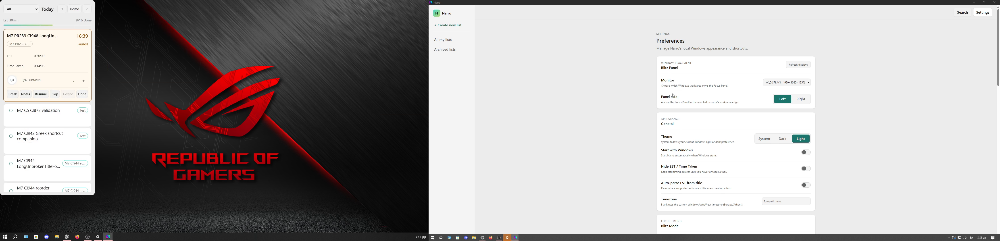

# CI953 dual-display supplemental Windows evidence

Whole recording: **549.734s (~9m10s),4480x1080/60fps**, actual two-display activity after Duplicate->Extend. No new visual denominator, whole-source or milestone completion claim. Visual review remains **44/100,56OPEN**; M1 1/1 examined FAIL27, M5 12/25, M6 16/31, M7 13/29, M8 2/8, M9 0/6. The [previous packet](../m7-ci953-gaps-20261005/README.md) already closes all six partial acquisition cells.

- [Whole original MKV](video/2026-10-05%2015-22-38.mkv) and [whole H264/AAC stream-copy MP4](video/2026-10-05-dual-full.mp4).
- [Chronological CSV](chronological-actions.csv), [91 native actions](chronological-actions.jsonl), original [actions](actions.jsonl)/[tool output](raw-actions.log).
- [Whole11-file Narro-M7-Logs](Narro-M7-Logs) and [verified ZIP](Narro-M7-Logs.zip).
- [M1–M9 dispositions](session-m1-m9-matrix.json), [native settled geometry](inventory/settled-geometry-verification.json), [read-only ledgers](inventory/ledger-verification.json), [exact provenance/capture limitations](provenance.json), [media probe](inventory/recording-ffprobe.json), [whole OBS log](inventory/obs-recording-log.txt), [SHA256 manifest](sha256-manifest.json).

Original UTC0 is approximately2026-10-05T12:22:39.113968+00:00 (file creation,±1s), not filename local time. Exact native UTC actions are retained. OBS reports114 rendering-lag frames(0.3%) and23 encoding-skipped frames(0.1%); distinguish capture stalls from app motion in later analysis. Adaptive native probes/recovery waits are included; only exercised/bookmarked intervals establish evidence. Audio is retained.

## Exercises and scoped results

At12:20:47Z UltraGear was available but inactive; LG was active. Actual OBS start12:22:38Z precedes actual DisplaySwitch Duplicate then Extend. The first immediate adapter-mode probe was unsettled and showed only one desktop adapter; later native QueryDisplayConfig proves both independent active source paths. Settled desktop: UltraGear2560x1080/100% primary(0,0), LG1920x1080/125% secondary(-1920,0). No explicit primary-monitor selection was made. Windows restored its configured layout.

Actual Timer padding drag12:25:20Z crosses UltraGear100→LG125; same HWND7471826, host(-1721,425),425x875. Actual reverse padding drag12:28:34Z reaches UltraGear100 at(781,344),340x700. The earlier title-origin input12:24:31Z produced no displacement and cannot establish drag PASS; subsequent observed blank header padding did. Compact/expanded, populated four-subtask view, actual locateCtrlShiftP and Panel/Timer transitions are captured in normal/reduced modes on both displays. Populated Timer Notes is exposed on LG without editing data. Inactive full host geometry is not the visible compact region, so do not call its875px host overflow a rendered defect without the native region/pixels.

Explicit current-display selection plus actual Left/Right controls and Timer->Panel re-entry reaches all four expected native anchors:

| Panel | Left x | Right x | DPI/host |
| --- | --- | --- | --- |
| UltraGear |0|2220|96 /340x700|
| LG TV |-1920|-425|120 /425x875|

These are **scoped native geometry PASS**, not canonical/static/full-motion review. Early probes immediately after Preferences clicks retain previous geometry. **32 / REVIEW_PENDING** records that direct live monitor/side relocation is not proven; explicit re-entry succeeds. Reconcile the actual apply intent before a FAIL/fix claim. The raw250ms post-expansion guard rejected a temporarily absent Return button without input; a fresh provider snapshot recovered. Do not label that guard rejection an app failure. Some early probe filenames say LG while the observed Focus was still100%/UltraGear; recorded native DPI/bounds take precedence over the filename.

The543s health frame confirms both captured displays and the LG-left Panel; it is not a counted review cell or canonical comparison. Native [navigation image](observations/navigation-dual.png) is also retained. No complete frame-by-frame/source review is claimed in this capture-only phase.

## Data, build and continuation

Exact source38219e200fe3bec7309f8e03e72003184ca86d08, [CI953](https://github.com/MariosGiannakaras/Narro/actions/runs/37258629373), artifact11324640580, EXEbde7646d9a3f17af0078c41e8a90173bc044f6747d24fde278e6f5739ebe05d8. Runtime141908 / Main3213706 / same Focus7471826. No source/test/build/CI change, no tray Quit/relaunch test; historical953C5 PASS is preserved in the full logs and not recounted. Live141908 logs are a bounded snapshot.

Read-only before/after owned task identities, existing sessions/notes/time and paused checkpoint including timestamp match exactly. Active846s/801308ms paused. Preference payload restores automatic/null monitor, Right, light; its updatedAt legitimately changes from actual selections. Earlier owned manual-origin120s fixture (English total147s) is unchanged. No whole user database is exported. Final compact Timer(781,344) on UltraGear100, paused16:39/0of4; Windowsdark/Narrolight/normal animation restored. Both displays remain active. Main remains maximized on UltraGear, Preferences open. OBS is stopped.

Pre/post current TODO/HANDOFF/crosswalk were inspected/copied into inventory. Selected-monitor/DPI27,07read responsiveness,23provider/source, C4/source/motion remain OPEN;28/29/30/31/32 await analysis. No cable/sleep/wake or quiet-performance acceptance. M10 hard entry blocked, M11 dormant. Preserve uncompiled async-worker WIP. The next analysis chat should consume the whole media and pending56 review cells; do not repeat the captured dual setup without a distinct unmet criterion. Additional physical-only work must name its uncovered path and refresh M1–M9 gates before/after. Announce every actual milestone completion and all required M1–M9 complete before M10.
