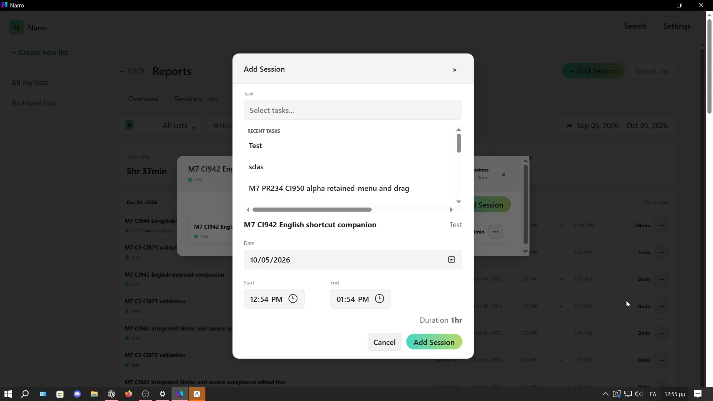

# CI953 acquisition gap closure — whole evidence

This packet completes capture of the **six existing partial cells** in [the earlier populated-interface packet](../m7-ci953-interfaces-20261005/README.md). It adds no review denominator. Current registered visual review is **44/100 reviewed, 56 OPEN**; the appended30 cells are now30/30 capture-ready and0/30 visually reviewed. M1 1/1 examined FAIL27; M5 12/25; M6 16/31; M7 13/29; M8 2/8; M9 0/6. These are campaign review counts, not whole-product UI or milestone implementation completion.

## Whole media and navigation

- [Whole original OBS MKV — 18m08.7s](video/2026-10-05%2012-45-14.mkv)
- [Whole playable H264/AAC MP4 — stream-copy remux](video/2026-10-05-gaps-full.mp4)
- [Chronological CSV](chronological-actions.csv) and [110 curated native actions](chronological-actions.jsonl); original [raw actions](actions.jsonl) and [mixed tool output](raw-actions.log) remain intact.
- [Six-cell capture closure](acquisition-closure-matrix.json), [current30-cell acquisition matrix](current-acquisition-matrix.json), [unchanged review counts](visual-progress.json), [M1–M9 session dispositions](session-m1-m9-matrix.json).
- [Whole11-file Narro-M7-Logs](Narro-M7-Logs) and [byte-verified ZIP](Narro-M7-Logs.zip).
- [Before/after data verification](inventory/ledger-verification.json), [capture provenance](provenance.json), [media probe](inventory/recording-ffprobe.json), [whole OBS log](inventory/obs-recording-log.txt).

The4480x1080/60fps canvas retains the original dual layout, but only LG1920x1080/125% was active. Do not infer two-display validation from canvas width. Offsets use original file creation09:45:15.096Z as an approximate anchor (±1s); exact native UTC actions are authoritative. There are adaptive UIA/state-inspection waits; blank/idle spans do not prove acceptance. Original audio is retained. The original-derived600s health frame was inspected only to confirm capture/surface health, not to advance a review cell.

## Captured behavior, not visual PASS

| Existing cell | Approximate original seconds | Exercise |
| --- | --- | --- |
| M7-A08 |116–133|All six populated Timer action-hover slots, normal/reduced; prior packet has actual locate.|
| M5-A02 |136–215|Actual long subtask title edit/Save/restore/Cancel.|
| M5-A06 |269–343|Planning title keyboard focus, Tab/Shift+Tab, hover and all five action slots normal/reduced.|
| M9-A02 |344–465|This week Apply then Last30days Apply restoration.|
| M9-A04 |466–525|Actual Break filter Off→On→Off with no Add/Edit modal.|
| M9-A05 |525–1085|Owned manual Add120s; actual end-time inline Edit180s→120s; Escape/recovery/detail close.|

Normal/reduced fresh planning-title focus exposes one Task actions button. This path had no preceding drag, so it does not resolve observation28 (post-drag keyboard rail). Reports date Apply produces Oct05–Oct05 (today is Monday), then restores Sep05–Oct05. Filter native caption/toggle state is Hide/Off→Show/On→Hide/Off. Do not infer hidden Break-row content beyond the captured owned table.

## Bookmarks for later requirement/source review

**30 / REVIEW_PENDING:** Add Session Recent Tasks picker has a visibly present horizontal scrollbar with the supplied long fixtures. Bookmark686.9s, navigation image below, and original600s frame preserve it. This is a distinct surface from provider inconsistency23; no reconciliation or source fix was performed.

**31 / REVIEW_PENDING:** actual manual Edit is reached through the displayed end-time button, not the Delete-only session menu. Native inline spinner/Save controls are present at~919.8s. Actual Save changes120→180→120 on the same session ID. Escape at~1009.9s leaves the inline editor open (probe~1010.9s); draft is restored/Save and task detail closed~1084–1085s. The raw bookmark notes an unsaved minute increment; the standalone increment lacks its own curated action row, so review the continuous interval before a stronger unsaved-value claim. A missing Edit Session modal is not a demonstrated defect. Older Add-modal Escape29 remains separate and pending.

[Native navigation image](observations/navigation-manual-add.png) is a navigation aid, not a canonical/source-parity comparison. No new gallery/whole-video visual review is claimed in this acquisition-only phase.

## Exact build, data and continuation

Exact source `38219e200fe3bec7309f8e03e72003184ca86d08`, full Windows [CI953](https://github.com/MariosGiannakaras/Narro/actions/runs/37258629373), artifact11324640580, EXE SHA256 `bde7646d9a3f17af0078c41e8a90173bc044f6747d24fde278e6f5739ebe05d8`. Runtime141908 / persistent Focus7471826 / Main3213706. No app source/test/build/CI changes. Pre/post TODO/HANDOFF/crosswalk snapshots are retained in inventory. Historical953 C5 PASS is preserved in the whole logs; no tray Quit/relaunch test was rerun here. Live-session logs are a bounded snapshot, not a normal-exit proof.

Checkpoint payload and timestamp, preferences, existing task identities/list/lane/notes and existing sessions are unchanged. Four subtasks restore the same semantic data/order/incomplete state; only long-row2 updated_at changed legitimately. Active task stays paused846s/801308ms. A new owned manual-origin work session `e5487664-fcae-439a-86eb-e712bc873eb4` remains on owned English companion task `32fd4eee-8543-4cc1-9f63-39b44ba89178`, start09:54Z/end09:56Z/duration120s. Editing changes its source tag manual→edit without changing identity. Total closed work on that task27→147s; do not claim all Reports/time data unchanged or delete the fixture to conceal test state. No whole user database is exported.

OBS is stopped; final paused compact Timer is(660,494),0/4subtasks,16:39. LG125%, automatic/null monitor, Windowsdark/Narrolight, normal animation restored. UltraGear inactive. No new dual/topology/cable/sleep/quiet-performance claim. Gates07/23/27/28, C4 and source/motion acceptance remain OPEN; bookmarks29/30/31 need analysis. M10 entry remains blocked; M11 dormant.

**Next:** review26 frozen original pending cells plus30 appended cells using whole originals/canonical fixtures in another analysis chat. All six acquisition gaps are closed; do not repeat them just because visual review is open. Further physical sessions require a named uncovered acceptance path (dual topology only when the display is available; quiet performance uses its separate protocol). Continue physical acquisition only, preserve separate uncompiled read-worker WIP. Announce each actual milestone completion and all required M1–M9 completion before M10.

The requested Antigravity Desktop shortcut launched before capture, independently of Narro acceptance. During post-capture export the user requested closure: Antigravity closed, Chrome was absent, AnyDesk user windows/processes closed; its system service could not be stopped with current rights. No service startup setting was changed.

Integrity inventory: [SHA256 manifest](sha256-manifest.json), raw archive attributes preserve original bytes. ZIP integrity and original-copy equality were checked before freezing; staged Git blobs are checked before commit.
