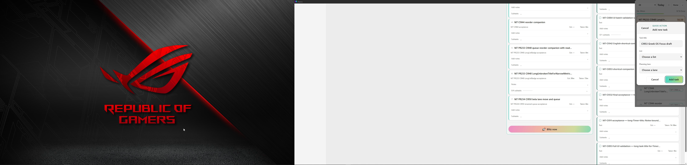

# CI953 actual Windows Greek input-layout modal evidence

## Current — CI953 actual Greek keyboard-layout capture; visual review44/100

[Whole 99.517s original MKV/MP4, health image, full logs/ZIP and chronological actions](work-log/evidence/m7-ci953-layout-20261005/README.md). Actual Windows focused WebView HKL4080408 verified on Main3213706 and Focus7471826 while Add task button focused. Actual physical Ctrl+Alt+T opens each Add dialog; draft typed, focused Add tested with Ctrl+Alt+B/P/N; actual Escape cancellation. Both return to HKL4090409. Normal motion only. This closes the earlier missing input-layout acquisition, not full M8 shortcut/source acceptance. Read-only task/checkpoint/preference payload exactly unchanged; no created task/session. No app source/tests/build/CI changes. Whole live logs are a bounded snapshot; historicalC5 PASS preserved, not rerun.

**Visual review44/100,56OPEN unchanged:** M1 1/1 examined FAIL27; M5 12/25; M6 16/31; M7 13/29; M8 2/8; M9 0/6. No new denominator or accepted milestone counter. Exact38219e20/CI953/artifact11324640580/EXEbde7646d; runtime141908, same Focus7471826; final paused compact native host{'x': -1113, 'y': 705, 'width': 425, 'height': 875} at DPI120; Main All Lists/Notes collapsed, both displays active, Windowsdark/Narrolight/normal motion. OBS stopped/flushed. Gates07/23/27/C4 and source parity remain OPEN;28–34 await analysis. M10 blocked/M11 dormant.

**Continuation:** next independent acquisition is a separately owned running work→pause/resume→real EST expiry/Time's Up→Extend/Done/Switch and break workflow, with a fresh pre-session matrix and explicit durable fixture/session deltas. Do not claim the current paused ledger unchanged after a live workflow. Existing56 pending cells and bookmarks need later whole-recording/canonical review. Desktop Publish-Narro-Evidence.bat is installed/tested and publishes only a prepared SHA-verified packet/tracking; no active-recording sealing or source upload. Preserve uncompiled async-worker WIP. Announce actual milestone completion and all M1–M9 gates complete before M10.

[Whole MKV](video/2026-10-05%2016-24-29.mkv), [whole MP4](video/layout-full.mp4), [actions](chronological-actions.jsonl), [logs ZIP](Narro-M7-Logs.zip), [provenance](provenance.json), [M1–M9 matrix](session-m1-m9-matrix.json), [SHA manifest](sha256-manifest.json).

The health image is not a counted visual review. Normal motion only, no reduced-motion or global-shortcut matrix claimed in this short packet. Do not infer pass for unrelated surfaces merely appearing. UIA provider snapshots show each local-key state; unchanged owned checkpoint corroborates no unintended work/break transition. No whole user database exported.
