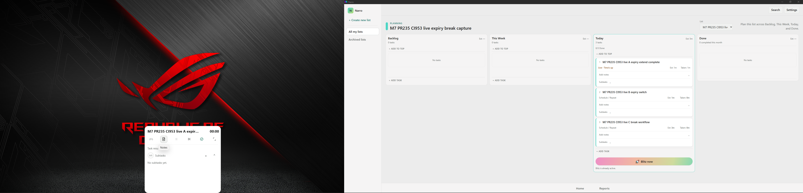

# CI953 live work, expiry, break and completion Windows evidence

## Current — CI953 live/expiry/break/completion acquisition; visual review44/100

[Whole 1339.617s recording, verified multipart MKV/MP4, native images, whole logs/ZIP, CSV and chronological actions](work-log/evidence/m7-ci953-live-20261005/README.md). Actual own list/three tasks; real A/B60sEST expiry, work pause/resume/button+CtrlAltP, compact/expanded while live, ATimeUp→Extend/overtime→Done, BTimeUp→Skip→C; real manual break41s skipped and natural300s break expiry→running work. Enabled success screen from expandedTimer C reduced100/B normal100 (B entryTimer125 moves to actual100 success); Take a Break is disabled37. Reports owned work/break list, chart tooltip, actual hide/showBreak rows and CSV5rows exercised during ongoingBreak. No app source edits/tests/builds/CI/merge; previous WIP backup remains separate.

**35 observed FAIL, pending full recording/source review:** domain A time_up/60000ms13:58:13Z, expandedTimer remains00:00/Pause/Task resumed through13:58:53Z; Main cardTimeUp. Actual ReturnPanel recoversTimeUp. **36 REVIEW_PENDING:** Panel/success re-entry resets selected listAll; successNextTask selects older ownedC5fixture instead of B, recoveryPause leaves explicitly retained51swork. **37 OPEN:** successTakeBreak disabled with implementation-status copy. FunGIFenabled for B but visible/animated parity is not established. Do not infer125 success PASS from an entry/filename; native successDPI is96 in both cases.

**Visual review44/100,56OPEN unchanged:** M1 1/1 examinedFAIL27; M5 12/25; M6 16/31; M7 13/29; M8 2/8; M9 0/6. Supplemental acquisition is not new reviewed cells or milestone acceptance. New retained completed A/B/C work totals76/90/87s; Cbreak41+300=341s. OlderC5fixture8410→8461s from NextTask; original95aTimeTaken846 preserved, old801ssegment closed and new paused session9e190776 with326ms. Checkpoint is legitimately different, not unchanged. All other previously snapshotted owned task records match exactly. Preference payload restored, updatedAt legitimately changed. No fixture deletion/clock manipulation/wholeDB export.

Final original95a paused, same runtime141908/Focus7471826/Main3213706, compact{'width': 425, 'x': -1235, 'height': 875, 'y': 429} atDPI120, both displays active, MainPreferences, Windowsdark/Narrolight/normal motion. Remaining countdown is new-session30:00 (before16:39); record this task-switch/session behavior without calling it a presentation-only reset. Whole11logs/live bounded snapshot includes historicalC5 PASS, not rerun. OBS stopped/flushed. Gates07/23/27/C4/source remainOPEN,28–37 await analysis; M10 blocked/M11 dormant.

**Continuation:** later chat can analyze56 registered pending cells plus supplemental35–37 from whole media/canonical fixtures and disposition only sufficiently exercised requirements. Distinct physical gaps: explicit125% success geometry (currentAUTO chooses100%primary), success TakeBreak actual path cannot run while disabled, remaining preference/shortcut/error/motion matrix and separate quiet performance/sleep/wake/topology as required. Do not repeat completed live/expiry/defaultBreak setup merely because review is pending. Capture-only priority; preserve WIP backup, announce actual milestone completion/all M1–M9 complete before M10. DesktopBAT publishes prepared frozen evidence/tracking, not active recordings.

## Whole media and analysis navigation

Whole original MKV and stream-copy playable MP4 are preserved in ordered64MiB binary parts under video/, with whole-file SHA256 in [reassembly manifest](video/media-reassembly.json). Join parts as binary bytes and verify the listed whole hash. Local Desktop `Narro-Evidence-Tools/Reassemble.ps1 -MediaDirectory <absolute video directory>` can do this. No frames/audio omitted. No executable helper is part of this evidence-only commit. [Chronological CSV](chronological-actions.csv), [native actions](chronological-actions.jsonl), [bookmarks35–37](observations/bookmarks.json), [M1–M9 matrix](session-m1-m9-matrix.json), [whole Narro logs ZIP](Narro-M7-Logs.zip), [data deltas](inventory/ledger-verification.json), [provenance](provenance.json), [OBS log](inventory/obs-recording-log.txt), [SHA manifest](sha256-manifest.json).

Important original intervals (UTC exact actions in manifest; file creation offsets±1s): Aactualstart13:56:53, pause13:57:19, resume13:57:21, localPpause13:57:44, resume13:58:01; domainTimeUp13:58:13 while expanded remainsstale, Panelrecovery13:58:53. Extend13:59:18, Done13:59:34 autostartsB. BPanelTimeUp real14:00:34, Skip14:01:05; CBreak14:01:06→Resume/skip14:01:47, work resume14:03:37, five-minuteBreak14:04:12→actualexpiry14:09:12. Settings duringbreak restoresdefault10 whilecurrent5 persists. CSuccessexpanded/reduced14:10:04, NextTask14:10:54 unexpectedlyoldC5, Pause14:11:46; explicitBMakeLive14:12:07, crossDPI14:12:34, BComplete/normal14:12:38. FinaloriginalMakeLive/Pause14:14:32/33. No static sampled frame establishes a full motion PASS.

CSV was exported14:07:07 and contains5owned rows, work0/35/60/76 and break41. It predates the secondbreak/completion tail; finalsessiontruth is ledger-after, not this early export. Chart click pinned actual tooltip, not a separate day drilldown. Lastrestore now projects30:00 remaining/new326ms checkpoint;846s historicalTaken is preserved. The start/stop wall-clock timestamps include paused waits, not accumulatedwork; do not subtract wall time to infer workduration.

Health images at1120/1245s are original-derived navigation checks, not additional reviewed cells. Capture includes necessary UIA/read-only diagnostics and native recovery but no repo/source-debugging interval. No new native quiet-performance measurement or source parity claim. Same Focus HWND is retained throughout.
