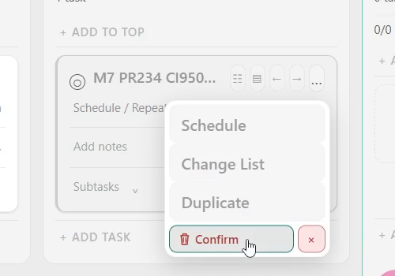
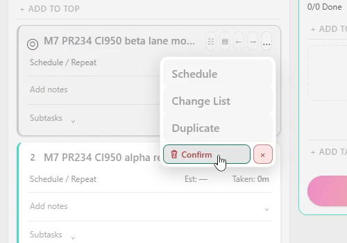
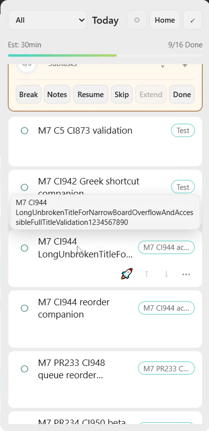
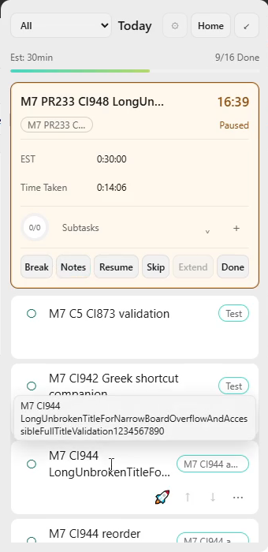
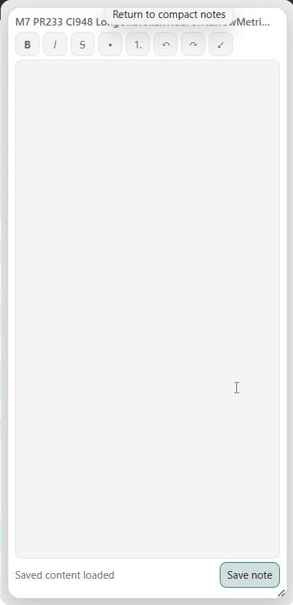
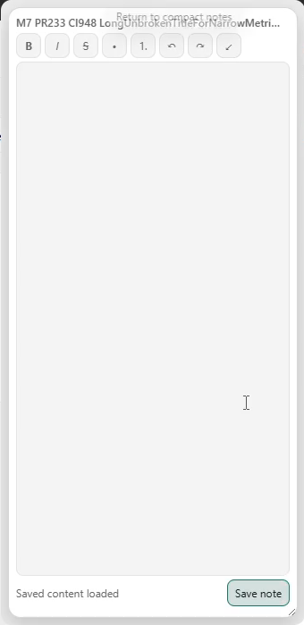

# CI953 Windows evidence

Frozen38219e20 / CI953 full PASS / artifact11324640580 / EXEbde7646d. [Results and continuation](../../2026-10-05-codex-m7-ci953-physical-results.md). Actual LG1920×1080 at100/125%, whole4480×1080/60fps original canvas; unused part black. No dual-monitor claim. Whole current active-session **Narro-M7-Logs** folder and verified ZIP included; this953 snapshot does not establish formal tray/restart/C5 PASS.

## Read first

- [Chronological actions](native/actions.jsonl), [timeline CSV](chronological-manifest.csv), [exact provenance](provenance.json), [ledger checks](ledger-verification.json).
- [Whole logs folder](Narro-M7-Logs), [whole logs ZIP](Narro-M7-Logs.zip).
- [Full raw-video SHA/parts/probes](video-manifest.json), [all-file SHA manifest](manifest.json).
- Initial10414.4s original includes a long unattended/minimized gap; count only exercised timestamps in the results. Its eight40MiB parts reassemble exactly; all other originals are stored whole. Database backup excluded.

## Playable original-frame views

- [Initial125 pointer interactions](clips/initial125-pointer.mp4).
- [Reduced125 menu interval](clips/reduced125-retained-menu.mp4).
- [Dense125 session](clips/dense125.mp4).
- [Dense100 session](clips/dense100.mp4).
- [125 restoration/automatic monitor](clips/restore125-automatic.mp4).
- [Real reduced125 metric Save and provider probe](clips/reduced125-metric-save-provider.mp4).

MP4s stream-copy H264 original frames, video only. Originals retain their recorded streams. Detailed source/motion review remains OPEN; these excerpts are navigation aids, not a replacement for whole evidence.

## Directly reviewed native frames

Four retained-menu paint states visibly contain the confirmation above disabled metadata; full source/motion acceptance remains OPEN.

|125 normal|125 reduced|
|---|---|
|||

|100 normal|100 reduced|
|---|---|
|||

|Contained full title125|Contained full title100|
|---|---|
|||

|Large Notes125|Large Notes100|
|---|---|
|||

[Exact frame offsets/crops](gallery-manifest.json). These PNGs are derived from the originals; they were not separate repeated acceptance captures. Native navigation screenshots are retained as recovery evidence and are labelled accordingly.

## Reassemble the split original

Download originals/2026-10-05 06-45-55.mkv.part001 through part008. Concatenate their bytes in ascending part order, then verify the SHA256 and333653082-byte size in video-manifest.json. Do not treat each part as a playable MKV. Reassembly was verified before publication. Other originals can be played directly.

New27 FAIL reopens narrow M1/M6/M8 monitor/DPI recovery; M7 C4/07/source gates OPEN. Native23 provider assertion remains inconsistent without demonstrated horizontal movement. Current3/10M, M74/5; M10 blocked, M11 dormant.
