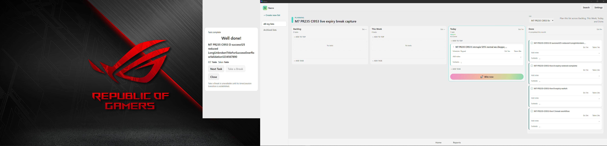

# CI953 real125% success normal/reduced Windows evidence

## Current — CI953 real125% success capture; visual review44/100

[Whole 373.400s original MKV/MP4, images, whole logs/ZIP and actions](work-log/evidence/m7-ci953-success125-20261005/README.md). Explicit Narro LGmonitor selection, no Windowsprimarychange. Actual reducedD and normalE success from expandedTimer bothnativeDPI120/425x875(-425,0), sameFocus7471826: scopednativegeometryPASS only, source/motionOPEN. LongunbrokenD and GreekE titles captured. ActualTab/ShiftTab/Escape closesD; focusedClose+localB/P/N onEsuccess leavesownedtask/checkpointexactlyunchanged; actualCloseE. FunGIFenabledE but effectiveanimateddecoration remainsunproven;37TakeBreakdisabled. Ownedlistallfivecompleted/emptylivecaptured. NoNextTaskrepeat, newolderC5delta or ordinaryusertaskchange.

**Visual review44/100,56OPEN unchanged:** M1 1/1examinedFAIL27; M5 12/25; M6 16/31; M7 13/29; M8 2/8; M9 0/6. No newreviewdenominator/milestoneacceptance. D/E are new retained completed ownedfixtures with nonzero[21, 30]swork. Existingownedrecords identical except original95a sessionlifecycle; original846s preserved, newpausedsessioncf3403c5-0336-4486-abbe-4d0f7453e1c7/327ms. PreviousA/B/C76/90/87work,341break and oldC5+51 delta unchanged. Preferencepayloadrestoredauto/nullmonitor,right/light,showSuccessfalse/FunGIFfalse/defaultBreak10; updatedAtlegitimatelychanged. Normalmotionrestored.

Final sameCI953/38219e20/bde7646d, runtime141908/Main3213706/Focus7471826, original95apaused, compact{'height': 875, 'x': -1235, 'width': 425, 'y': 429} atDPI120, MainPreferences, bothdisplaysactive. OBSstopped/flushed. Whole11logs are livebounded snapshot/historicalC5PASS notrerun. Earlier35expandedTimeUp observedFAIL,36selectionreset/NextTask REVIEW_PENDING,37disabledTakeBreak remainOPEN;07/23/27/C4/sourceOPEN. M10blocked/M11dormant. Temporary250msexpandprovider guard rejectedmissingReturn beforeinput, freshprobe recovered; noappfailureinferred.

**Continuation:** true125%successnormal/reduced acquisition is nowclosed; do notrepeatit solelybecausecanonical/motionanalysisispending. Review56registeredpendingcells plus35–37/supplementalGIF/title/keyboard states fromwhole recordings. Remainingdistinctphysicalrequirements should be selected fromcurrentTODO/crosswalk: quietperformance asaseparate nonrecordingprotocol; actualsleep/wake/topology whereavailable; remainingPreferences/shortcut/notificationmatrix ifalreadyimplemented. SuccessTakeBreak cannot beacceptedasPASSwhilecontrolisdisabled. Captureonly; existingWIPsourceandtoolsbackeduponbranch842c162f; noNarrosourcefix/build/CI. Announceactualmilestonecompletion/allM1–M9acceptancebeforeM10.

[Whole original MKV](video/2026-10-05%2017-23-36.mkv), [whole H264/AAC MP4](video/success125-full.mp4), [chronological CSV](chronological-actions.csv), [exact provenance](provenance.json), [nativegeometry/keyboardverification](inventory/success125-verification.json), [owneddata/prefsverification](inventory/ledger-verification.json), [M1–M9matrix](session-m1-m9-matrix.json), [wholelogsZIP](Narro-M7-Logs.zip), [SHAmanifest](sha256-manifest.json).

These nativepixels confirm the navigation/state; they are not additional registeredreviewcells or fullmotion/canonicalPASS. Nativehost is425x875 insideLG1920x1080; no ordinaryHWND/WebViewreplacement. Source details/animations require the wholecapture. D/E creation and title/draft states are retained separately, normal/reduced differ in title/keyboardexercise rather than being an identical-fixturemotioncomparison. EFunGIFstate is true, but noaccessibleImage orobviousstaticdecoration establishes effectiveanimation. NoFunGIFfailureclaimsolelyfromstaticimage. PreviousTakeBreakdisabled is stillsufficientlyobservedOPEN.
