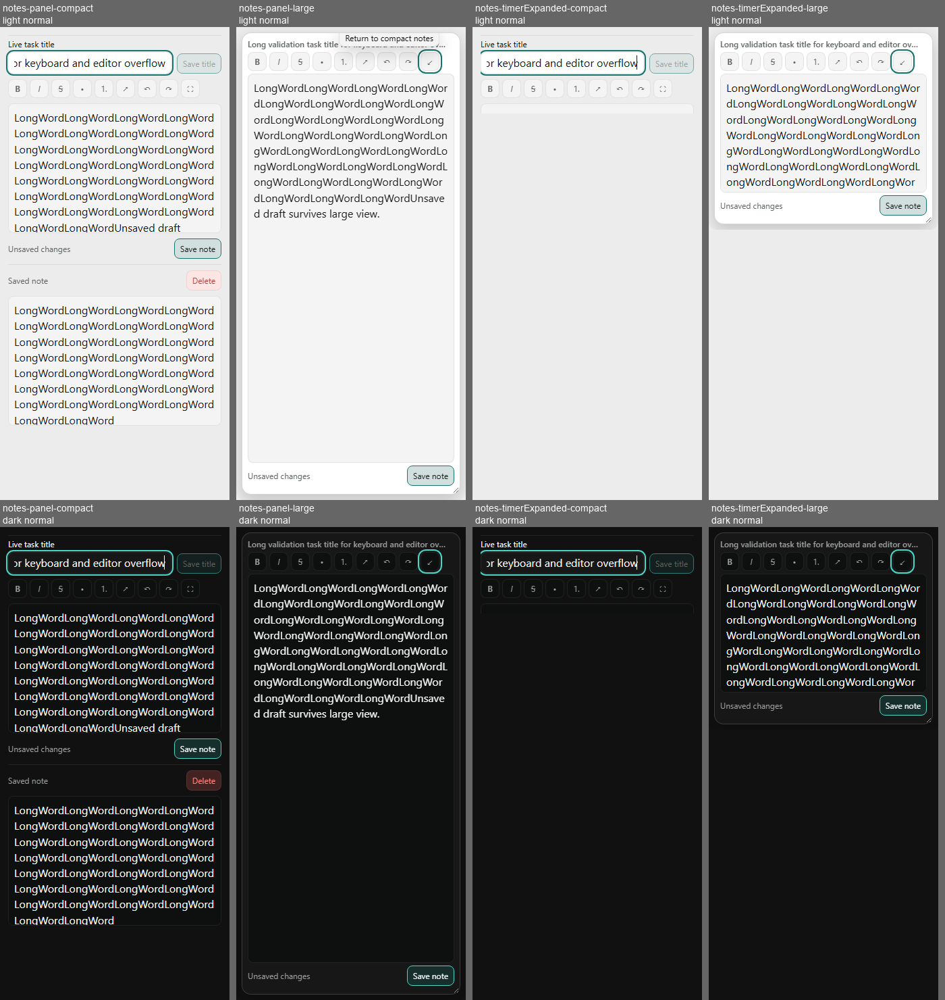
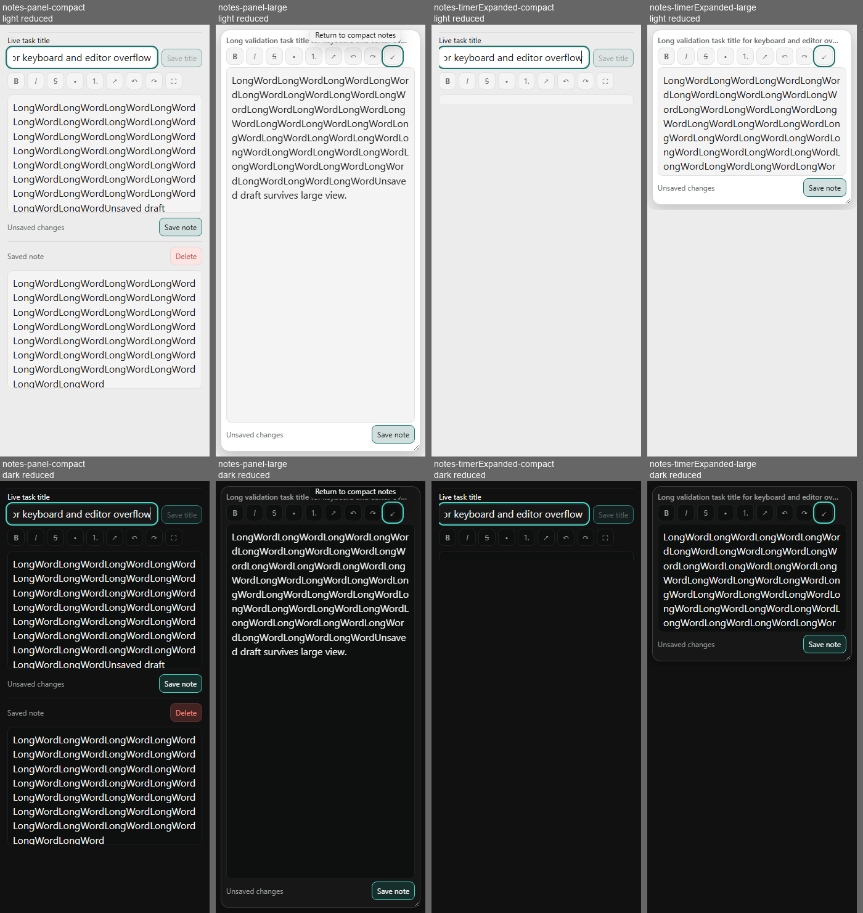

# PR #222 final local regression evidence

Source: `549536c4d19b0045a928652d3feff53162f55a6e`. Final candidate CI: [Windows #893](https://github.com/MariosGiannakaras/Narro/actions/runs/37134207962). Source/config/test diff: 16 files, `+392/-11`, against current application base `f1cca810ea7d7fe6130d43ae0f6bfe649a7154af` (documentation-only base advances do not change this count).

**PASS:** full final frontend preflight; Rustfmt; 30 rendered cases. The latter comprise 18 light/dark Notes, quick-create keyboard and transition-ownership cases plus 12 real renderer reduced-motion counterparts for affected Notes/transition cases. The requested motion preference is verified with `matchMedia`, then computed behavior is tested.

Notes cases assert no horizontal geometry overflow, title-field bounds, large-editor/Save containment, bounded resize, Escape, retained draft/editor node, keyboard-open tooltip, a real normal-motion opacity transition, reduced-motion behavior and tooltip Escape. Quick-create cases exercise delayed success/error/empty reads, loading/settled focus containment, ready title focus, Tab wrapping and Escape/trigger focus restoration. Transition cases assert sole ready-target ownership in both directions and immediate outgoing-content rollback.

The before-correction HTML preserves the reproduced tooltip transition failure. The transient failed preflight preserves Windows mapped-icon error 1224; after restoring generated icons, the complete retry PASSed. Local Rust compilation/Clippy/tests were **NOT RUN**, because MSVC `link.exe` is unavailable; full Windows CI is authoritative for them.

[CI #892 failure log](ci892-motion-preference-failure.txt) preserves a test-environment failure: normal capture inherited reduced motion from the Windows host. The final harness explicitly selects normal or reduced motion for these cases using Chromium's separate override switches and verifies the actual media preference. [Primary Chromium implementation](https://chromium.googlesource.com/chromium/src/+/refs/tags/140.0.7291.1/ui/gfx/animation/animation.cc). Existing unrelated fixture captures retain their previous preference behavior.

## Visual inspection

Both sheets below were inspected, covering all 16 Notes endpoints (four presentation cases × two themes × normal/reduced). The large editor and Save fit their visible 700/300px regions; long words wrap; light/dark contrast, focus outline and resize affordance remain visible. Compact Notes retains intentional vertical scrolling. A horizontally scrolling single-line title input is distinct from an overflowing Notes container.

Each original 1280×720 PNG has a paired HTML with the completed JSON contract. Quick-create PNGs show the final closed state after Escape/focus restoration; their intermediate keyboard assertions are in the HTML, not proven by that endpoint image. Transition fixtures use controlled hierarchies with real production coordinator CSS; they do not drive a native window. Headless capture hides scrollbar chrome, so horizontal geometry checks are not physical scrollbar acceptance.

**Physical Windows, native DPI/geometry, continuous compositor motion, same-EXE restart, performance and Blitzit visual parity remain OPEN.** These captures do not replace the exact-executable physical run. The previous 18-case local snapshot remains historical; this directory supersedes it for the final source.

[Provenance/source hashes](provenance.json), [complete frontend preflight](frontend-preflight.txt), [before-correction tooltip failure](tooltip-before-correction.html), [transient environment failure](transient-icon-lock-preflight.txt), [per-file manifest](manifest.json).
